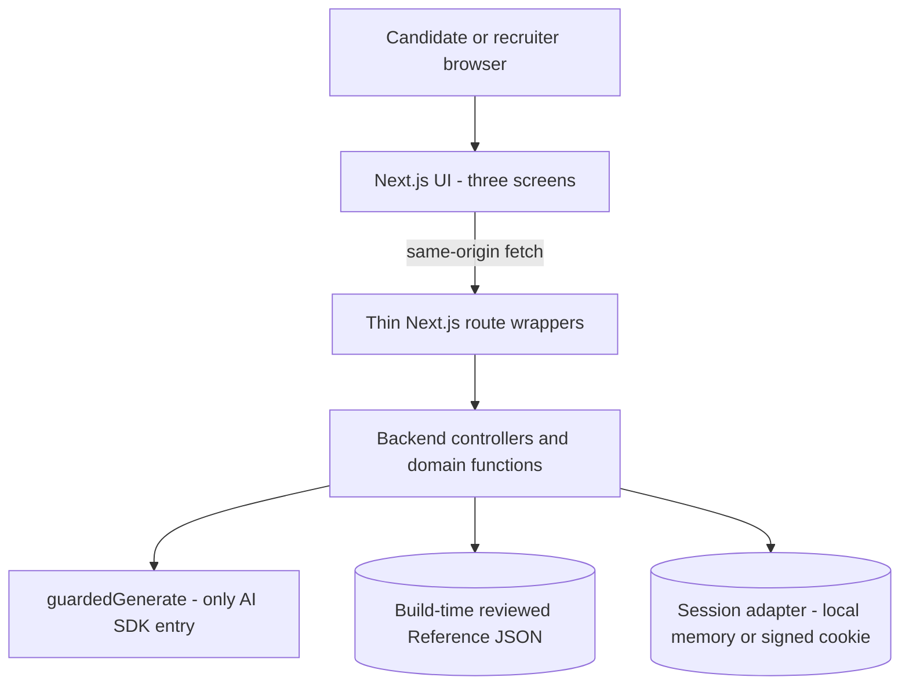
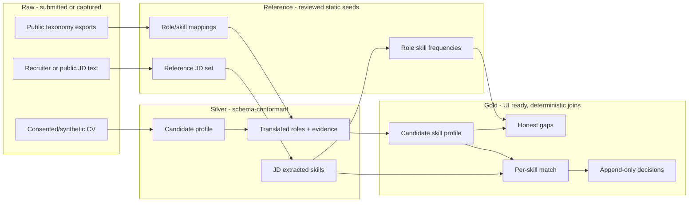

# Skill Bridge Architecture

This document defines both the implemented live-app scaffold and the production-minded next layer. The stage-safe deliverable remains the static `app/demo.html`; the Next.js app now implements the same three-screen flow with provisional synthetic/reference fixtures and a guarded AI boundary. Demo mode is deterministic and does not require an API key.

## 0. Functional inventory

Every function below maps to one or more acceptance-criteria bullets in `Skill-Bridge-User-Stories.md`. Each names its trigger, ordered processing, persisted/in-session artifact, and failure behavior.

### 0.1 Acceptance-criteria coverage index

The fine-grained rows below are the audit checklist. Several rows intentionally share one orchestration function later in this section, but each has its own trigger/data effect and can be tested independently.

| Capability | Detailed operation | Implemented by | Screen/layer |
| --- | --- | --- | --- |
| US-1 | Upload and validate PDF/DOCX | F1.1, step 1 | Candidate profile |
| US-1 | Extract text and parse roles | F1.1, steps 2-5 | Raw -> Silver |
| US-1 | Flag every missing/ambiguous field | F1.2 | Candidate review |
| US-1 | Confirm/complete a flagged field | F1.3 (`candidate_confirmed`) | Candidate review |
| US-1 | Edit/correct an extracted field | F1.3 (`candidate_edited`) | Candidate review |
| US-2 | Select target role/industry | F2.1, trigger/input | Candidate review |
| US-2 | Name an AU-equivalent role/function | F2.1, translation output | Silver translation |
| US-2 | Map cross-industry shared competency | F2.1, reviewed-reference join | Silver translation |
| US-2 | Omit unreliable/unsupported mapping | F2.1, omission artifact | Silver translation |
| US-3 | Explain each skill from source evidence | F3.1 | Silver evidence |
| US-3 | Group skills by relevance | F3.2 | Gold candidate profile |
| US-4 | Batch-extract reference JD skills | F4.1, offline mode | Raw/Reference -> Silver |
| US-4 | Aggregate per-role frequency | F4.2 | Silver -> Gold |
| US-4 | Sort/display frequency with robustness label | F4.2 output/UI | Recruiter context |
| US-5 | Compare candidate vs commonly expected skills | F5.1 | Gold gap view |
| US-5 | Return literal no-major-gaps state | F5.1 empty-result branch | Gold gap view |
| US-6 | Submit/extract one ad hoc JD | F4.1, runtime mode | Recruiter input |
| US-6 | Match candidate against this one JD | F6.1 | Gold match view |
| US-6 | Structurally forbid overall score | F6.1 schema invariant | All layers |
| US-6 | Reveal stored reasoning on hover/tap | F6.1 evidence resolution | Recruiter view |
| US-7 | Present recruiter actions only | F7.1 | Recruiter view |
| US-7 | Append a confirmed human decision | F7.2 | Gold event log |
| US-7 | Verify no automated consequential action exists | F7.1/F7.2 + tests | Whole product |

### F1.1 Parse a submitted CV (US-1.1, US-1.2)

- **Trigger:** Candidate selects a PDF or DOCX and submits the profile screen.
- **Processing:** Validate MIME type and size; extract text locally with `pdf-parse` or `mammoth`; hash the bytes; send extracted text once through `guardedGenerate()` using `CV_EXTRACT_V1`; validate the response with `CandidateProfileSilverSchema`; retry once only for schema repair; store the Raw metadata/text and Silver profile in the session.
- **Output:** `rawCv` plus `candidateProfileSilver`, containing roles, employers, countries, dates, responsibilities, `null` values with reasons, and document provenance. Non-standard order, multilingual headings, and non-US dates are explicitly permitted.
- **Edge cases:** Reject password-protected, empty, oversized, or unsupported files explicitly. Garbled extraction produces a visible error, not inferred content. A scanned image-only PDF with no extractable text returns `OCR_NOT_SUPPORTED` and asks for a text-based PDF/DOCX; OCR is intentionally outside hackathon scope. Missing fields remain `null`. If no role is identifiable, block translation rather than creating an empty profile. Accuracy is measured against an 80% field-identification golden-set bar.

### F1.2 Request confirmation for ambiguity (US-1.3)

- **Trigger:** F1.1 returns any field with `value: null`, `status: "ambiguous" | "missing"`, or low extraction confidence.
- **Processing:** Deterministically enumerate unresolved field paths; render a confirmation form with the source excerpt and reason; do not call the LLM again.
- **Output:** `profileReviewTasks[]`, each with `fieldPath`, `sourceExcerpt`, `reason`, and `resolutionStatus`.
- **Edge cases:** A candidate may leave a field unresolved; downstream translation excludes it and labels the exclusion. No silent default is allowed.

### F1.3 Edit or confirm a parsed field (US-1.4)

- **Trigger:** Candidate saves an edit or confirms an extracted value.
- **Processing:** Validate the field-specific value; append a provenance event; update a new immutable profile revision; mark the field `candidate_edited` or `candidate_confirmed`; invalidate Gold artifacts derived from the prior revision.
- **Output:** `candidateProfileSilver.revision + 1` and append-only `profileProvenanceEvents[]` with previous/new values, timestamp, and actor `candidate`.
- **Edge cases:** Blank required edits remain unresolved. Concurrent edits require the latest revision number and return `409 REVISION_CONFLICT`; no edit silently overwrites another.

### F2.1 Translate cross-border and cross-industry experience (US-2.1-US-2.4)

- **Trigger:** Candidate confirms the Silver profile and chooses a target role/industry.
- **Processing:** For each valid role, join against reviewed `roleMappings.reference.json`; send only the structured role plus candidate-selected target through `guardedGenerate()` using `SKILL_TRANSLATE_V1`; validate `TranslatedRoleSilverSchema`; deterministically remove unsupported mappings whose `sourceEvidenceIds` do not resolve to the candidate profile or reference record; combine role results.
- **Output:** `translatedRolesSilver[]` containing original title/country, explicit AU-equivalent function for overseas roles, mapped skills, shared competency for cross-industry mappings, source evidence, rationale, and omitted fragments with reasons.
- **Edge cases:** No reasonable mapping is represented as an omission, never a forced match. Missing target role blocks cross-industry mapping. A role may yield zero translations. No aggregate person score exists in the schema.

### F3.1 Explain transferable skills (US-3.1, US-3.2)

- **Trigger:** A validated translated skill from F2.1 lacks reviewed display rationale.
- **Processing:** Pass the translated skill and exact source experience to `guardedGenerate()` using `SKILL_EXPLAIN_V1`; require a one-sentence rationale with valid source evidence ID; validate and reject claims that cannot be traced to that source.
- **Output:** `skillEvidenceSilver` with `skill`, `sourceExperienceId`, `sourceQuote`, and plain-language `whyItTransfers`.
- **Edge cases:** Missing evidence prevents display. Duplicate skills merge evidence lists deterministically; the LLM never invents additional experience.

### F3.2 Group skills by relevance (US-3.3)

- **Trigger:** All F3.1 artifacts for the current profile revision are valid.
- **Processing:** Deterministically join skills with target-role reference mappings; assign `direct`, `transferable`, or `supporting` groups from reviewed mapping rules; sort within groups by reference priority and evidence count, never by an overall candidate score.
- **Output:** `candidateSkillProfileGold.groups[]`, ready for candidate UI.
- **Edge cases:** Unmapped but evidenced skills appear under `supporting`; empty groups are omitted; ties use alphabetical ordering for stability.

### F4.1 Extract skills from one job description

- **Trigger:** A reference JD is ingested offline or a recruiter submits one JD at runtime. Candidate state is not required for JD upload, extraction, mapping, or weighting; it is required only when F6.1 begins.
- **Processing:** Accept pasted text or extract text from a recruiter-uploaded PDF/DOCX (10 MB maximum); preserve Raw text and source metadata; call `guardedGenerate()` once with `JD_EXTRACT_V1`; validate normalized skills and evidence spans; classify each skill as `essential`, `important`, or `supporting` from the JD language; deterministically normalize priority points (5/3/1) into per-skill percentages totalling 100; reject any skill without a source span. The percentages rank job requirements, never candidates.
- **Output:** `jobDescriptionSilver` with one document ID and extracted skills containing `requirement`, `importance`, `weight`, and `evidenceSpan`.
- **Edge cases:** Boilerplate-only or garbled input fails explicitly. An empty valid requirements list is permitted and clearly reported.

### F4.2 Aggregate frequency across many reference JDs (US-4.1-US-4.3)

- **Trigger:** Candidate target role has a reviewed set of pre-extracted reference JDs.
- **Processing:** Load multiple `jobDescriptionSilver` records; deduplicate skills within each JD; count document occurrence, not term occurrence; sort descending; attach source JD IDs. This is deterministic and does not call an LLM.
- **Output:** `roleSkillFrequencyGold` containing `jdCount`, per-skill `documentCount`, percentage, and `robustness: "indicative" | "sample"`; fewer than five JDs must be `indicative`.
- **Edge cases:** Zero JDs returns `REFERENCE_SET_UNAVAILABLE`. Ties are alphabetical. This function is intentionally separate from F6.1, which compares one candidate with one JD.

### F5.1 Identify honest gaps (US-5.1-US-5.3)

- **Trigger:** Candidate views a target role after F3.2 and F4.2 exist.
- **Processing:** Deterministically left-join expected reference skills against candidate skills; retain only skills above the team's reviewed frequency threshold; produce neutral descriptions from committed reference copy, not a runtime LLM.
- **Output:** `gapAnalysisGold` with `gaps[]` separate from matches; if empty, `summary` is exactly `No major gaps identified`.
- **Edge cases:** Missing or indicative reference sets are labelled and cannot support a definitive claim. Gaps are never penalties or rejection signals.

### F6.1 Match candidate skills to one JD (US-6.1-US-6.3)

- **Trigger:** Recruiter submits one JD and selects an existing candidate profile revision.
- **Processing:** Run F4.1 once for the JD; compare each JD skill with the candidate's validated skills/reference synonyms; optionally use `guardedGenerate()` with `SKILL_MATCH_V1` only for bounded semantic relations; validate `high | medium | low`, evidence IDs, and reused US-3 rationale; produce one row per required JD skill.
- **Output:** `candidateJobMatchGold.skillMatches[]`, each with its JD priority/weight, per-skill match level, JD evidence, candidate evidence or explicit absence, and rationale. There is structurally no total/aggregate candidate-score field.
- **Edge cases:** No candidate evidence forces `low`; conflicting mappings are flagged for recruiter review. Hover/tap details resolve the stored evidence chain, not a new LLM call.

### F7.1 Present human review only (US-7.1)

- **Trigger:** A validated F6.1 artifact loads.
- **Processing:** Render evidence and only three recruiter-initiated actions. UI constants and schema enums exclude auto-approve/auto-reject.
- **Output:** Human-review screen with `Shortlist`, `Needs more info`, and `Not a fit` controls.
- **Edge cases:** Invalid/partial match artifacts show an error and no decision controls.

### F7.2 Append a recruiter action (US-7.2, US-7.3)

- **Trigger:** Recruiter explicitly selects an action and confirms it.
- **Processing:** Validate action enum, match/profile revision, and optional note; append a new event to session state; never update or overwrite a prior event.
- **Output:** `decisionEvents[]` with unique ID, action, actor label, timestamp, match ID, profile revision, and note. UI copy states: “The recruiter decides; Skill Bridge only explains.”
- **Edge cases:** Double submission is idempotent by client request ID. Without authentication, actor identity is a session-entered display label and is explicitly non-verifiable.

## 1. Application architecture

### 1.1 Stack and deployment unit

- **Framework:** Next.js 15 App Router + React 19 + TypeScript
- **Styling:** Tailwind CSS 4
- **Validation/contracts:** Zod 4 with `zod-to-json-schema`
- **AI SDK:** official `openai` JavaScript SDK using structured JSON output
- **Text extraction:** `mammoth` for DOCX and `pdf-parse` for PDF
- **State:** Zustand in the browser; a signed, compressed `jose` cookie for public single-session deployment; optional process-memory adapter only for local presentation
- **Testing:** Vitest, Testing Library, MSW, and Playwright
- **Package manager:** pnpm

Everything runs in one Next.js process and one deploy. `frontend/`, `backend/`, and `infra/` are concern boundaries, not services.



The static `app/demo.html` sits outside this request path and remains the safest stage deliverable. The route/controller/domain path above is implemented and testable independently.

### 1.2 Implemented folder and route layout

```text
app/
├── page.tsx                         # role selector for Candidate, HR, and Admin
├── candidate/page.tsx               # candidate dashboard -> profile/skills journey
├── hr/page.tsx                      # HR dashboard -> match/human decision journey
├── admin/page.tsx                   # demo governance/readiness dashboard
├── profile/page.tsx                 # Screen 1 wrapper -> frontend/screens/ProfileScreen
├── skills/page.tsx                  # Screen 2 wrapper -> frontend/screens/SkillsScreen
├── review/page.tsx                  # Screen 3 wrapper -> frontend/screens/ReviewScreen
└── api/
    ├── profiles/parse/route.ts       # thin wrapper -> backend/controllers/parseProfile
    ├── profiles/[id]/route.ts        # GET/PATCH wrapper -> profile controller
    ├── profiles/[id]/translate/route.ts
    ├── reference/frequency/route.ts
    ├── matches/route.ts
    └── matches/[id]/decisions/route.ts
frontend/
├── screens/                         # three screen compositions
├── components/                      # uploader, field review, evidence card, gap list, action log
├── api/client.ts                    # only browser access to backend: same-origin fetch
├── state/sessionStore.ts            # Zustand state + cookie hydration
└── types/contracts.ts               # API-facing types re-exported from shared contracts
shared/contracts.ts                  # dependency-neutral browser/server contract types
backend/
├── controllers/                     # orchestration called only by route wrappers
├── domain/                          # F1.1-F7.2 pure/domain functions
├── schemas/                         # all Zod Raw/Reference/Silver/Gold/API schemas
├── repositories/                    # reference files + interchangeable session adapter
├── prompts/                         # versioned prompt text named in §3
└── ai/guardedGenerate.ts             # sole allowed OpenAI client import
infra/
├── env.ts                           # environment validation
├── session/localMemory.ts           # local-only adapter
├── session/signedCookie.ts          # public single-session adapter
└── telemetry.ts                     # redacted errors/latency, never CV text
data/reference/                      # reviewed, build-time JSON seeds
tests/{unit,integration,golden-set,adversarial,e2e}/
```

**Import rule:** `frontend/**` may import `frontend/**` and shared contract types, never `backend/**`. It calls same-origin APIs with `fetch`. `app/api/**` may import backend controllers. Only `backend/ai/guardedGenerate.ts` may import `openai`; lint rule `no-restricted-imports` rejects all other imports. A future service split therefore changes the API base URL/deployment, not domain/UI code.

Candidate, HR, and Admin are presentation-level roles, not security principals. `/candidate` and `/hr` expose the two product journeys; `/admin` exposes read-only demo governance. With no authentication or authorization in hackathon scope, these routes must not be treated as access control.

### 1.3 API contracts

All errors use `{ "error": { "code": string, "message": string, "retryable": boolean, "fieldPaths"?: string[] } }`; no route fabricates success data.

| Route | Request | Success response | Functions |
| --- | --- | --- | --- |
| `POST /api/profiles/parse` | multipart `file`, `consentConfirmed: true`, `clientRequestId` | `201 { profileId, revision, profile, reviewTasks }` | F1.1-F1.2 |
| `GET /api/profiles/:id` | session + ID | `200 { profile, reviewTasks, provenanceEvents }` | Read current F1 artifacts |
| `PATCH /api/profiles/:id` | `{ revision, edits: [{ fieldPath, value, action: "edit"|"confirm" }] }` | `200 { revision, profile, reviewTasks }` | F1.3 |
| `POST /api/profiles/:id/translate` | `{ revision, targetRoleId, targetIndustryId? }` | `200 { translatedRoles, skillProfile, gaps, frequencyContext }` | F2.1-F5.1 |
| `GET /api/reference/frequency?targetRoleId=...` | target role ID | `200 { roleSkillFrequency }` | F4.2 |
| `POST /api/jds/parse` | multipart optional `file` (PDF/DOCX), optional `text`, `sourceLabel` | `201 { jd, rawText, fileName }`; `jd.skills[].weight` totals 100 | F4.1 |
| `POST /api/matches` | `{ profileId, revision, jd: { text, sourceLabel }, clientRequestId }` | `201 { matchId, skillMatches, humanReviewCopy }` | F4.1, F6.1-F7.1 |
| `POST /api/matches/:id/decisions` | `{ clientRequestId, action: "shortlist"|"needs_more_info"|"not_a_fit", actorLabel, note? }` | `201 { event, decisionEvents }` | F7.2 |

### 1.4 State, storage, and errors

| Data | Physical location | Lifetime |
| --- | --- | --- |
| Static demo personas | Embedded in `app/demo.html` | Build/repo lifetime |
| Reference taxonomies, reviewed mappings, JD-derived skills | `data/reference/*.json`, imported at build/start | Versioned release |
| Raw CV/JD and Silver/Gold session artifacts | Local demo: process memory; public demo: encrypted/signed size-bounded client cookie, with raw text kept browser-side | One session only |
| UI navigation/draft edits | Non-persisted browser Zustand store | Current loaded app only; deliberately cleared on reload so browser IDs cannot outlive process-memory backend records |
| Secrets | Server environment variables | Process/deploy |
| Production history | No storage in hackathon scope | Not available |

The local presenter mode is the default because a single long-lived process makes in-memory session behavior predictable. Do not deploy the memory adapter to Vercel/serverless functions: requests can hit different stateless instances and lose state. If a public URL is required, use the signed-cookie adapter for a small synthetic demo or a host with one persistent process (for example Render/Fly.io). Never place API keys or sensitive Raw text in a cookie.

Reference JSON is imported as modules, so it is baked into a production build. Editing `data/reference/*.json` under local development may hot-reload, but a deployed build requires rebuild/redeploy before seed changes take effect.

### 1.5 Database roadmap, not hackathon scope

No database is an intentional simplification. Introduce PostgreSQL with Drizzle ORM when the product requires any of: concurrent users, persistence across visits/devices, authenticated recruiter identity on the append-only decision log, audit retention, or PRD §5.2 learning features that aggregate candidates, JDs, and outcomes over time. Migration requires authenticated tenancy, encrypted Raw storage with retention/deletion policy, relational profile revisions/evidence/decision events, background reference ingestion, and privacy review. None belongs in the current demo.

## 2. Data pipeline and reference build



No new real-world facts enter at Silver or Gold. Silver is derived by named extraction/translation prompts from Raw plus reviewed Reference. Gold is derived by deterministic joins/aggregation over named Silver/Reference artifacts; no LLM reinterprets Raw text after Silver.

### 2.1 Raw and Reference provenance

| Item | Real-world source | Role |
| --- | --- | --- |
| Candidate CVs/work histories | Team-authored synthetic personas for demo, or a real candidate who explicitly consented to this use | Raw, unstructured |
| Ad hoc recruiter JD | Text pasted by the recruiter from their own organisation's job description | Raw, unstructured |
| Reference JDs | Public postings manually captured from SEEK, LinkedIn, Indeed, or Jora; record publisher, URL, role, location, and capture date; do not include applicant data | Raw input to reviewed Reference set |
| Australian occupations | Australian Bureau of Statistics ANZSCO classifications and Jobs and Skills Australia occupation material | External taxonomy input |
| Cross-market occupations/skills | European Commission ESCO and US Department of Labor O*NET public datasets | External taxonomy input |
| Target role list and mapping priorities | Explicit team decision documented with reviewer/date; not externally sourced | Reference product decision |
| Reference rationales | Team-reviewed wording grounded in the cited taxonomy rows and JD evidence | Reference derived copy |

### 2.2 Reference build process

1. Team chooses target roles/industries and records decision owner/date.
2. Download/export named ANZSCO, ESCO, and O*NET occupation/skill records; retain dataset version, source URL, and license metadata. Never ask an LLM to invent or recall entries.
3. Normalize stable IDs, titles, aliases, and skill labels with deterministic scripts. Keep raw exports outside the committed app seed if licensing forbids redistribution.
4. Capture a dated set of public SEEK/LinkedIn/Indeed/Jora postings per target role with URL/publisher/location. Respect terms and retain only the minimum job text needed; no applicant data.
5. Run `JD_EXTRACT_V1` once per captured JD to draft structured skill rows with exact evidence spans. Schema validation rejects unsupported output.
6. An LLM may compare already-sourced taxonomy rows, propose candidate crosswalks, summarize evidence, and draft rationale text. It may never assert that a taxonomy entry, posting, employer requirement, or statistic exists without a retained source record.
7. A human reviewer checks every mapping and extracted skill against the retained source, resolves synonyms, rejects forced equivalences, and signs `reviewedBy/reviewedAt` before commit.
8. Deterministically compute `roleSkillFrequency` from reviewed JD skills. Commit versioned JSON plus provenance manifest. Any source/seed/model change triggers tests in §4.

### 2.3 Core schemas

Schemas shown are shortened JSON Schema representations; implementation uses Zod and rejects unknown fields.

#### Candidate profile Silver

```json
{
  "type": "object",
  "required": ["profileId", "revision", "document", "roles", "provenanceEvents"],
  "additionalProperties": false,
  "properties": {
    "profileId": {"type": "string"},
    "revision": {"type": "integer", "minimum": 1},
    "document": {"type": "object", "required": ["rawHash", "sourceType", "consentConfirmed"]},
    "roles": {"type": "array", "items": {"type": "object", "required": ["id", "title", "employer", "country", "dates", "responsibilities"], "properties": {
      "title": {"$ref": "#/$defs/reviewableField"}, "employer": {"$ref": "#/$defs/reviewableField"}, "country": {"$ref": "#/$defs/reviewableField"}, "dates": {"type": "object"}, "responsibilities": {"type": "array", "items": {"type": "object", "required": ["id", "text", "sourceExcerpt"]}}
    }},
    "provenanceEvents": {"type": "array"}
  },
  "$defs": {"reviewableField": {"type": "object", "required": ["value", "status", "reason"], "properties": {"value": {"type": ["string", "null"]}, "status": {"enum": ["extracted", "missing", "ambiguous", "candidate_confirmed", "candidate_edited"]}, "reason": {"type": ["string", "null"]}}}}
}
```

Derived by `CV_EXTRACT_V1` from the Raw CV, then candidate revisions; it introduces no independent facts.

#### Translation/skill Silver

```json
{
  "type": "object",
  "required": ["profileId", "profileRevision", "targetRoleId", "translatedRoles"],
  "additionalProperties": false,
  "properties": {
    "translatedRoles": {"type": "array", "items": {"type": "object", "required": ["sourceRoleId", "auEquivalentFunction", "skills", "omissions"], "properties": {
      "auEquivalentFunction": {"type": ["string", "null"]},
      "skills": {"type": "array", "items": {"type": "object", "required": ["skillId", "label", "sharedCompetency", "sourceEvidenceIds", "whyItTransfers"], "properties": {"sourceEvidenceIds": {"type": "array", "minItems": 1}}},
      "omissions": {"type": "array", "items": {"type": "object", "required": ["sourceEvidenceId", "reason"]}}
    }}
  }
}
```

Derived by `SKILL_TRANSLATE_V1` and `SKILL_EXPLAIN_V1` over Candidate Silver plus reviewed mappings.

#### JD Silver

```json
{
  "type": "object",
  "required": ["jdId", "rawHash", "source", "skills"],
  "additionalProperties": false,
  "properties": {
    "source": {"type": "object", "required": ["producer", "sourceUrl", "capturedAt"]},
    "skills": {"type": "array", "items": {"type": "object", "required": ["skillId", "label", "requirement", "evidenceSpan"], "properties": {"requirement": {"enum": ["required", "preferred"]}}}
  }
}
```

Derived by `JD_EXTRACT_V1` from one Raw JD; never independently authored.

#### Candidate profile, gaps, match, and decisions Gold

```json
{
  "$defs": {
    "candidateSkillProfileGold": {"type": "object", "required": ["profileId", "revision", "groups"], "properties": {"groups": {"type": "array", "items": {"type": "object", "required": ["kind", "skills"], "properties": {"kind": {"enum": ["direct", "transferable", "supporting"]}}}}},
    "gapAnalysisGold": {"type": "object", "required": ["targetRoleId", "gaps", "summary", "referenceRobustness"]},
    "candidateJobMatchGold": {"type": "object", "required": ["matchId", "profileRevision", "jdId", "skillMatches"], "additionalProperties": false, "properties": {"skillMatches": {"type": "array", "items": {"type": "object", "required": ["jdSkillId", "matchRate", "reason", "jdEvidence", "candidateEvidenceIds"], "properties": {"matchRate": {"enum": ["high", "medium", "low"]}}}}},
    "decisionEvent": {"type": "object", "required": ["eventId", "clientRequestId", "matchId", "profileRevision", "action", "actorLabel", "createdAt"], "properties": {"action": {"enum": ["shortlist", "needs_more_info", "not_a_fit"]}}}
  }
}
```

Gold is produced only by F3.2/F4.2/F5.1/F6.1/F7.2 deterministic joins and append operations over named Silver/Reference artifacts. The match schema deliberately has no aggregate-score property.

## 3. Prompt-to-layer map and guarded generation

| Prompt | Input -> output | Trust boundary |
| --- | --- | --- |
| `CV_EXTRACT_V1` | Raw CV text -> Candidate Profile Silver | Schema + one repair retry + explicit failure |
| `JD_EXTRACT_V1` | One Raw JD -> JD Silver | Evidence span required; batch/offline for reference JDs |
| `SKILL_TRANSLATE_V1` | Candidate Silver role + reviewed Reference -> Translation Silver | Reference/source IDs must resolve |
| `SKILL_EXPLAIN_V1` | One translated skill + source evidence -> rationale field | Exact source ID required |
| `SKILL_MATCH_V1` | Candidate Skill Gold + one JD Silver -> per-skill relations | No aggregate; low when unsupported |

`guardedGenerate()` owns model/version selection, timeout, redaction, structured-output request, Zod validation, one bounded schema-repair retry, and typed failure. Route handlers cannot call the SDK. F4.2 and F5.1 are deterministic; they are not prompts despite any pseudocode in the prompt library.

## 4. Testing, verification, and Zero-AI-Trust

### 4.1 Enforcement by layer

| Layer | Concrete stop mechanism |
| --- | --- |
| Per LLM call | Structured output + Zod `strict()` validation; evidence-ID resolution; one repair retry; typed failure, never fallback fabrication. |
| Silver | Contract tests reject unknown/missing fields, untraceable evidence, and any person-level aggregate. Profile revisions retain candidate edit provenance. |
| Reference | Every row has source/version/URL and `reviewedBy/reviewedAt`; build refuses unsigned rows. LLM proposals never commit automatically. |
| Gold | Pure deterministic joins; schemas structurally omit aggregate score; unmatched requirements are `low`; decision events are append-only. |
| Hiring decision | UI exposes recruiter actions only after valid evidence loads; a human reviews output and initiates every event. |

### 4.2 Concrete test layout

```text
tests/
├── unit/             # Vitest: parsers, joins, grouping, frequency, gaps, schemas; mocked LLM
├── integration/      # Vitest + MSW: route handlers and session adapters; mock only OpenAI network boundary
├── golden-set/       # Hand-labelled CV/JD fixtures; paid/on-demand model regression and 80% parser bar
├── adversarial/      # Paid/on-demand probes: inflated claims, unsupported JD skills, prompt injection, garbled files
└── e2e/              # Playwright against running app; US-1 through US-7 walkthrough
```

Unit and integration tests run on every commit and never make real LLM calls. Golden-set, adversarial, and e2e suites run on demand according to the retest matrix. The exact static-demo personas receive a manual pre-pitch spot-check; this has no folder because it is a human activity.

Named checks include:

- Schema tests reject aggregate fields such as `candidateScore`, invalid decision actions, missing evidence, and unknown properties.
- Golden-set field extraction meets at least 80% role/duration/responsibility accuracy on non-standard CV fixtures and detects every intentional ambiguity.
- Adversarial probes attempt to inflate unsupported candidate skills, inject instructions through CV/JD text, turn missing skills into medium matches, invent taxonomy/JD facts, and induce auto-reject language.
- Reference audit samples each committed mapping against its retained source and reviewer signature.
- Playwright walks upload/review/edit, translation/evidence, frequency/gaps, one-JD match, evidence reveal, and recruiter action directly against every acceptance criterion.

### 4.3 Retest matrix

| Change | Unit | Integration | Golden set | Adversarial | E2E | Human demo check |
| --- | :---: | :---: | :---: | :---: | :---: | :---: |
| Prompt text | Yes | Yes | Yes | Yes | Yes | Yes |
| Silver/Gold schema | Yes | Yes | Yes | Yes | Yes | Yes |
| Reference seed data | Yes | Yes | Yes | Targeted | Yes | Yes |
| Model or model version | Yes | Yes | Yes | Yes | Yes | Yes |
| Pure UI copy/style | Yes | If contract touched | No | Targeted invariant scan | Yes | Yes |

A model/version change always reruns live golden/adversarial checks even when prompts are unchanged. Store prompt, schema, seed, and model version with every test result.

## 5. Limitations, roadmap, and open items

### Current limitations accepted for the hackathon

- Deterministic demo fixtures prove the flow and interaction, not extraction accuracy or model reliability.
- No identity, persistence, audit-grade decision log, or concurrent usage.
- Current Reference mappings and JD frequencies are explicitly provisional synthetic fixtures; external-source review remains required before product evaluation.
- Per-skill `high/medium/low` is explainable but requires calibration and bias review before employment use.
- Formal credential equivalence, visa/work-rights checks, and automated hiring decisions remain out of scope per PRD §7.

### Roadmap

1. Replace provisional seeds with reviewed, dated Reference JSON sourced through the §2 process.
2. Expand the golden/adversarial fixtures and calibrate prompt/model behavior against them.
3. Run golden/adversarial evaluation and document limitations before enabling live AI in a presentation.
4. Add PostgreSQL + Drizzle, auth, retention controls, and auditability only when multi-user persistence or PRD §5.2 learning features become real requirements.

### Open items

The implemented default scope uses the Minh Tran demo persona, Business Operations Coordinator target role, provisional skill mappings, and a per-skill card UI with no aggregate score. Remaining product decisions are data-quality gates rather than code blockers: approve additional roles, sign off mappings, and capture a dated public JD sample set. Any resolution must update `PROMPTS.md`, this document, REPO_GUIDE, README, fixtures, and tests together.
