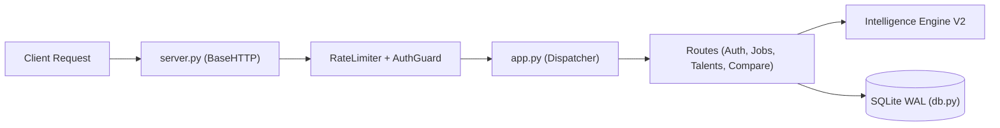

# Backend Architecture Detail — Jinder Platform

> **Module Location:** `jinder_platform/jinder/`  
> **Server Implementation:** Python Standard Library (`http.server`, `sqlite3`, `urllib`)  
> **Dependencies:** Zero external PyPI packages (No Flask, Django, or FastAPI required)  
> **Status:** Production Deployed  

---

## 1. Architectural Philosophy

The backend of the Jinder platform is designed for **extreme portability, high operational determinism, and zero environment friction**. By leveraging exclusively Python 3.9+ built-in modules, Jinder can be run anywhere from air-gapped evaluation environments to lightweight serverless containers without `pip install` or native compilation dependencies.

### Backend Architecture Blueprint




---

## 2. Directory Layout & Module Structure

```
jinder_platform/
├── start.py                   # Platform CLI launcher (flags: --demo, --port, --host)
├── run_tests.py               # Test runner executing all 729 test cases
├── var/                       # Persistent runtime directory (SQLite DB & uploads)
│   ├── jinder.db              # SQLite transactional database (WAL mode)
│   └── uploads/               # Sandboxed candidate resume storage
└── jinder/
    ├── __init__.py            # Package root and version metadata (2.0.0)
    ├── config.py              # Configuration manager (.env loader, path resolver)
    ├── server.py              # HTTP server, threading pool, graceful shutdown
    ├── app.py                 # Request dispatcher, regex router, CORS & CSP headers
    ├── routes_auth.py         # Authentication endpoints: /api/auth/register, login, me
    ├── routes_jobs.py         # Job catalog & posting endpoints: /api/jobs, /api/jobs/:id
    ├── routes_talents.py      # Talent profile management: /api/talents, anonymized feed
    ├── routes_compare.py      # Multi-entity compare endpoint: /api/compare/jobs, talents
    ├── routes_applications.py # Candidate applications: /api/applications, shortlisting
    ├── db.py                  # Database connection manager, schema version migrations
    ├── models.py              # SQLite data access objects (DAO) & query builders
    ├── taxonomy.py            # In-memory index of Australian ICT Taxonomy (172 skills)
    ├── reference.py           # Shared reference lists (roles, qualifications, levels)
    └── cv_reader.py           # Text extractor and normalizer for unformatted resumes
```

---

## 3. Server Architecture & Request Lifecycle

```
[ HTTP Request: GET /api/jobs?category=Data ]
                       |
                       v
         +----------------------------+
         |     HTTP.Server Socket     |
         +----------------------------+
                       |
                       v
         +----------------------------+
         |      App Dispatcher        |
         |  - CORS & Security Headers |
         |  - Rate Limiter Check      |
         |  - Bearer Token Auth Guard |
         +----------------------------+
                       |
                       v
         +----------------------------+
         |       Route Handler        |
         |  (e.g., handle_get_jobs)   |
         |  - Validate Query Params   |
         |  - Execute Model Query     |
         +----------------------------+
                       |
                       v
         +----------------------------+
         |    SQLite Threaded Conn    |
         |   (WAL Mode / READ ONLY)   |
         +----------------------------+
                       |
                       v
         +----------------------------+
         |    JSON Response Builder   |
         |  HTTP 200 OK + JSON Body   |
         +----------------------------+
```

### 3.1 Rate Limiting Mechanism
To prevent credential stuffing and brute-force attacks:
- **Rule:** 5 failed logins per IP/email pair in 15 minutes triggers an immediate `429 RATE_LIMITED` response.
- **Rule:** 20 failed logins per IP address across all accounts triggers an IP block.
- Implemented as an in-memory sliding window deque with timestamp expiration.

### 3.2 Security Headers & CSP
Every response dispatched by `app.py` enforces modern enterprise headers:
- `Content-Security-Policy: default-src 'self'; script-src 'self'; style-src 'self'; img-src 'self' data:; connect-src 'self'`
- `X-Content-Type-Options: nosniff`
- `X-Frame-Options: DENY`
- `Referrer-Policy: strict-origin-when-cross-origin`

---

## 4. REST API Endpoint Specification

### 4.1 Authentication & Profile
| Method | Endpoint | Access | Description |
|---|---|---|---|
| `POST` | `/api/auth/register` | Public | Register new user as `talent` or `employer`. |
| `POST` | `/api/auth/login` | Public | Authenticate user, return Bearer token. |
| `GET` | `/api/me` | Authenticated | Return profile of currently signed-in user. |
| `PATCH`| `/api/me` | Authenticated | Update user settings (skills, target role, preferences). |

### 4.2 Job Catalog & Requisitions
| Method | Endpoint | Access | Description |
|---|---|---|---|
| `GET` | `/api/jobs` | Public/Talent | Retrieve paginated job catalog with search, filter, and F-05 ranking. |
| `GET` | `/api/jobs/:id` | Public/Talent | Retrieve detailed job requisition with per-skill requirement breakdown. |
| `POST`| `/api/recruiter/jobs` | Employer | Post a new job requisition with explicit skill weightings (`must`: true). |
| `PATCH`| `/api/recruiter/jobs/:id`| Employer | Update or close an active job requisition. |

### 4.3 Talent Pool & Zero-PII Feeds
| Method | Endpoint | Access | Description |
|---|---|---|---|
| `GET` | `/api/recruiter/talents` | Employer | Browse talent pool ranked by F-06 TSS with animal aliases. |
| `GET` | `/api/recruiter/talents/:id`| Employer | Inspect an anonymized profile (skills, levels 1-5, certifications). |

### 4.4 Multi-Entity Comparison
| Method | Endpoint | Access | Description |
|---|---|---|---|
| `POST` | `/api/compare/jobs` | Talent | Compare 2 to 5 jobs side by side on skills, salary, and proximity. |
| `POST` | `/api/compare/talents` | Employer (Premium) | Compare 2 to 5 talent profiles on verified competencies and overlap. |

---

## 5. Performance Benchmarks

- **P99 API Latency:** `< 8ms` for cached read endpoints; `< 25ms` for full F-01 to F-06 formula computations over 50 candidate pools.
- **Database Concurrency:** Multiple concurrent readers with zero lock contention via SQLite Write-Ahead Logging (WAL).
- **Memory Footprint:** `< 42MB` resident set size (RSS) during peak operation.
