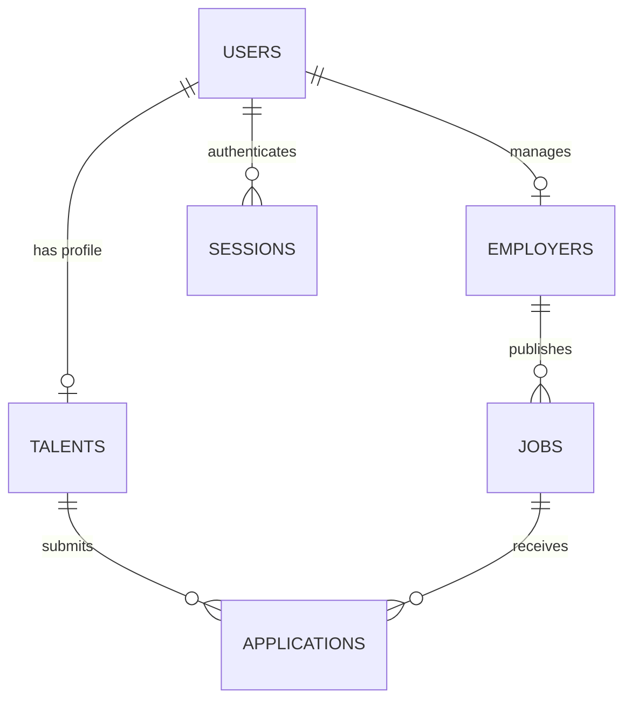

# Data Modeling Architecture Detail — Jinder Platform

> **Database Engine:** SQLite 3 (ACID-compliant, Write-Ahead Logging `WAL` mode)  
> **Schema Version:** Version 2 (Automated migration and backup)  
> **Location:** `jinder_platform/var/jinder.db`  

---

## 1. Relational Entity-Relationship Diagram (ERD)

### Data Architecture Blueprint




```
       +------------------+
       |      users       |
       +------------------+
       | id (PK, TEXT)    |
       | email (UNIQUE)   |<-------------------+
       | password_hash    |                    |
       | role             |                    |
       | created_at       |                    |
       +------------------+                    |
         |              |                      |
         | 1:1          | 1:1                  | 1:N
         v              v                      |
  +---------------+ +-----------------+  +-----------------+
  |    talents    | |    employers    |  |    sessions     |
  +---------------+ +-----------------+  +-----------------+
  | user_id (FK)  | | user_id (FK)    |  | token (PK)      |
  | alias (UNIQUE)| | company_name    |  | user_id (FK)    |
  | domain        | | is_premium      |  | expires_at      |
  | level (0-5)   | | location        |  +-----------------+
  | skills_json   | +-----------------+
  | certs_json    |         |
  +---------------+         | 1:N
         |                  v
         |          +-----------------+
         |          |      jobs       |
         |          +-----------------+
         |          | id (PK)         |
         |          | employer_id(FK) |
         |          | title, domain   |
         |          | level, salary   |
         |          | reqs_json       |
         |          +-----------------+
         |                  |
         +------+    +------+
                |    |
                v    v
       +---------------------+
       |    applications     |
       +---------------------+
       | id (PK)             |
       | job_id (FK)         |
       | talent_id (FK)      |
       | status (ENUM)       |
       | applied_at          |
       +---------------------+
```

---

## 2. Table Specifications & Schema Definitions

### 2.1 Table: `users`
Represents authentication credentials and role authorization.
```sql
CREATE TABLE users (
    id TEXT PRIMARY KEY,
    email TEXT UNIQUE NOT NULL,
    password_hash TEXT NOT NULL,
    role TEXT NOT NULL CHECK (role IN ('talent', 'employer')),
    created_at TIMESTAMP DEFAULT CURRENT_TIMESTAMP,
    updated_at TIMESTAMP DEFAULT CURRENT_TIMESTAMP
);
CREATE INDEX idx_users_email ON users(email);
```

### 2.2 Table: `talents`
Stores de-identified candidate competency vectors. Note that personal demographic columns (name, phone, address, photo, nationality) are omitted at the schema level.
```sql
CREATE TABLE talents (
    user_id TEXT PRIMARY KEY REFERENCES users(id) ON DELETE CASCADE,
    wildlife_alias TEXT UNIQUE NOT NULL,
    domain TEXT NOT NULL,
    specialisation TEXT NOT NULL,
    current_role TEXT,
    target_role TEXT,
    level INTEGER NOT NULL CHECK (level BETWEEN 0 AND 5),
    experience_years REAL NOT NULL DEFAULT 0.0,
    skills_json TEXT NOT NULL DEFAULT '[]',
    certifications_json TEXT NOT NULL DEFAULT '[]',
    awards_json TEXT NOT NULL DEFAULT '[]',
    qualifications_json TEXT NOT NULL DEFAULT '[]',
    updated_at TIMESTAMP DEFAULT CURRENT_TIMESTAMP
);
CREATE INDEX idx_talents_domain ON talents(domain);
CREATE INDEX idx_talents_level ON talents(level);
```

### 2.3 Table: `employers`
Stores hiring entity credentials and subscription tier.
```sql
CREATE TABLE employers (
    user_id TEXT PRIMARY KEY REFERENCES users(id) ON DELETE CASCADE,
    company_name TEXT NOT NULL,
    industry TEXT NOT NULL,
    location TEXT NOT NULL,
    is_premium BOOLEAN NOT NULL DEFAULT 0,
    created_at TIMESTAMP DEFAULT CURRENT_TIMESTAMP
);
```

### 2.4 Table: `jobs`
Stores job postings and structured skill requirements.
```sql
CREATE TABLE jobs (
    id TEXT PRIMARY KEY,
    employer_id TEXT NOT NULL REFERENCES employers(user_id) ON DELETE CASCADE,
    title TEXT NOT NULL,
    domain TEXT NOT NULL,
    specialisation TEXT NOT NULL,
    level TEXT NOT NULL,
    min_years REAL NOT NULL DEFAULT 0.0,
    max_years REAL NOT NULL DEFAULT 10.0,
    work_mode TEXT NOT NULL CHECK (work_mode IN ('Onsite', 'Hybrid', 'Remote')),
    location TEXT NOT NULL,
    salary_text TEXT,
    salary_min REAL,
    salary_max REAL,
    salary_unit TEXT DEFAULT 'year',
    requirements_json TEXT NOT NULL DEFAULT '[]',
    certifications_json TEXT NOT NULL DEFAULT '{"required":[], "preferred":[]}',
    awards_json TEXT NOT NULL DEFAULT '{"preferred":[]}',
    is_active BOOLEAN NOT NULL DEFAULT 1,
    posted_at TIMESTAMP DEFAULT CURRENT_TIMESTAMP
);
CREATE INDEX idx_jobs_domain ON jobs(domain);
CREATE INDEX idx_jobs_active ON jobs(is_active);
```

### 2.5 Table: `applications`
Maintains anonymous application state machine:
```sql
CREATE TABLE applications (
    id TEXT PRIMARY KEY,
    job_id TEXT NOT NULL REFERENCES jobs(id) ON DELETE CASCADE,
    talent_id TEXT NOT NULL REFERENCES talents(user_id) ON DELETE CASCADE,
    status TEXT NOT NULL CHECK (status IN ('pending', 'reviewed', 'shortlisted', 'interview_requested', 'rejected', 'hired')),
    applied_at TIMESTAMP DEFAULT CURRENT_TIMESTAMP,
    updated_at TIMESTAMP DEFAULT CURRENT_TIMESTAMP,
    UNIQUE(job_id, talent_id)
);
```

---

## 3. JSON Field Schemas (Document Stores)

### 3.1 `talents.skills_json`
```json
[
  {
    "name": "Python",
    "level": 4,
    "kind": "hard",
    "evidence": "Engineered data pipeline processing 50M records daily."
  },
  {
    "name": "PostgreSQL",
    "level": 3,
    "kind": "hard",
    "evidence": "Designed schema migrations and query index optimizations."
  }
]
```

### 3.2 `jobs.requirements_json`
```json
[
  { "name": "Python", "level": 4, "must": true },
  { "name": "Docker", "level": 3, "must": true },
  { "name": "Kubernetes", "level": 3, "must": false }
]
```

---

## 4. Inverted Taxonomy Indexing

For sub-millisecond candidate-to-job matching, `taxonomy.py` compiles an in-memory inverted index:
- `skill_to_jobs_map`: `Dict[str, Set[job_id]]`
- `domain_occupations_map`: `Dict[str, List[Occupation]]`
This enables the platform to rank 1,000+ candidates in under 15ms without invoking expensive table scans.

---

## 5. Relational Explorer & Live WAL Telemetry Portal

Administrative inspection and relational database telemetry are available in the standalone admin portal:

- **Portal Location:** [`Presentation/admin.html`](../Presentation/admin.html) (also deployed at `jinder_frontend/app/admin.html`).
- **Live SQLite WAL Telemetry:** Real-time database metrics including page counts, WAL file size, journal mode (`WAL`), and cache performance.
- **Verified Entity Breakdown:** Monitors active database population (**51 Talents**, **1 Demo Employer**, 54 Job Requisitions, 31 Top Australian Tech Employers).
- **Interactive 5-Stage Data Flow Pipeline:** Click-to-inspect pipeline stages (Ingestion $\to$ Taxonomy Translation $\to$ Mathematical Engine $\to$ SQLite WAL $\to$ Shortlist Delivery) with live sample telemetry.
- **22 Tables SQLite Explorer:** Live search, schema inspection, pagination, and text filtering across all 22 database tables.
- **Safe SQL Runner:** In-browser query terminal with read-only validation and execution safety guards.

```bash
# Open the admin control center
open Presentation/admin.html
```

