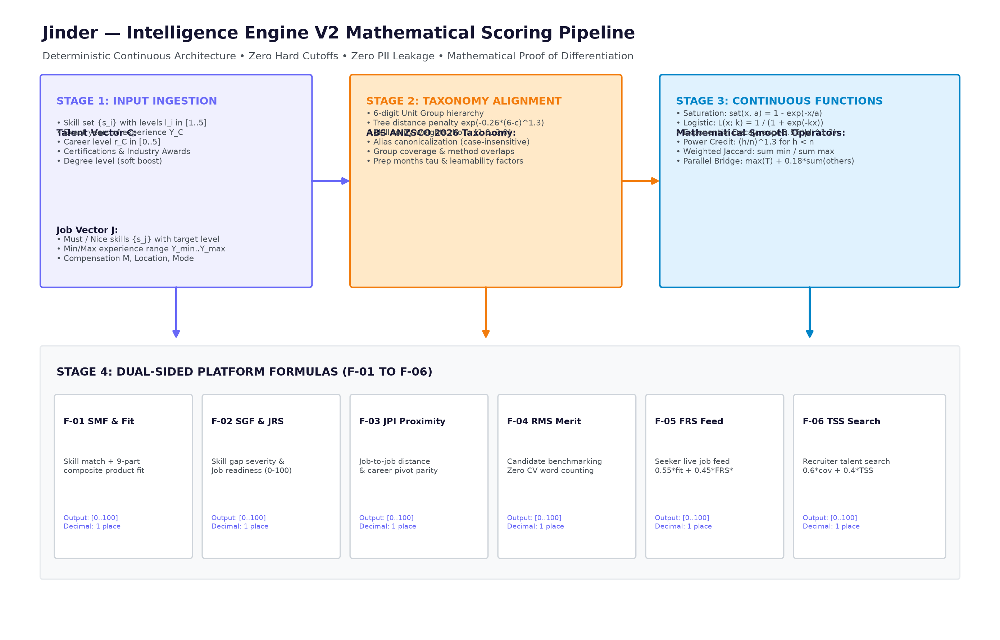
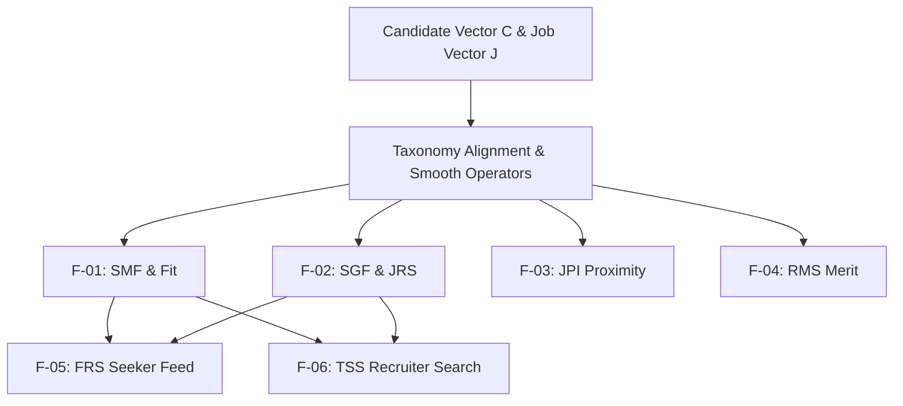

# Formula Architecture Detail — Jinder Intelligence Engine

> **Module Location:** `jinder_backend_engine/intelligence_engine/`  
> **Mathematical Nature:** Deterministic, Algebraic, and Statistical Formulations (Zero Black-Box Scoring)  
> **Range Bound:** Strictly normalized to the interval $[0.0, 100.0]$  

---

## 1. Mathematical Architecture Overview

In employment technology, black-box AI scores (e.g., arbitrary neural probability numbers) exacerbate recruitment bias and cannot be audited by regulators or users. Jinder replaces opaque scoring with **6 transparent, deterministic mathematical formulas (F-01 through F-06)**.

### Intelligence Engine V2 Scoring Pipeline




```
       Candidate Competency Vector [C]        Job Requirement Vector [J]
                     \                                   /
                      \                                 /
                       v                               v
             +---------------------------------------------------+
             |    F-01: Skill Match Frequency & Coverage (SMF)   |
             +---------------------------------------------------+
                                       |
                                       v
             +---------------------------------------------------+
             |    F-02: Gap Severity & Job Readiness (GSI / JRS) |
             +---------------------------------------------------+
                         /                   \
                        /                     \
                       v                       v
      +------------------------------+   +------------------------------+
      |  F-05: Talent Feed Rank (FRS)|   | F-06: Recruiter Search (TSS) |
      +------------------------------+   +------------------------------+
                       |                               |
                       v                               v
         Candidate Personalized Feed      Anonymized Employer Talent List
```

---

## 2. Formula Specifications & Mathematical Formulations

### 2.1 Formula F-01: Skill Match Frequency & Coverage (SMF)

#### Mathematical Definition
Computes the weighted skill coverage between candidate capabilities and job demands, accounting for mandatory vs. preferred skills and proficiency level depth:

$$SMF = \frac{\sum_{i \in S_{\text{match}}} w_i \cdot \min\left(1.0, \frac{L_{c,i}}{L_{j,i}}\right)}{\sum_{k \in S_{\text{job}}} w_k} \times 100$$

Where:
- $S_{\text{job}}$: The set of all skills demanded by the job requisition.
- $S_{\text{match}} = S_{\text{candidate}} \cap S_{\text{job}}$: The subset of overlapping skills.
- $w_i$: Weight of skill $i$:
  - $w_i = 2.0$ if skill $i$ is **Mandatory** (`must: true`).
  - $w_i = 1.0$ if skill $i$ is **Preferred** (`must: false`).
- $L_{c,i} \in [1, 5]$: Candidate's verified proficiency level in skill $i$.
- $L_{j,i} \in [1, 5]$: Job's required proficiency level in skill $i$.

#### Bounding Property
$$0.0 \le SMF \le 100.0$$

---

### 2.2 Formula F-02: Gap Severity Index (GSI) & Job Readiness Score (JRS)

#### Mathematical Definition
Penalizes candidates for missing requirements by categorizing gaps into **Statutory Blockers** (mandatory skills/licenses) versus **Learnable Tools** (frameworks that can be learned on the job):

$$GSI = \sum_{g \in S_{\text{gaps}}} \beta_g \cdot \text{Severity}(g)$$

Where:
- $S_{\text{gaps}} = S_{\text{job}} \setminus S_{\text{candidate}}$
- $\beta_g = 15.0$ if requirement $g$ is a **Statutory Blocker** (`must: true`).
- $\beta_g = 5.0$ if requirement $g$ is a **Learnable Tool** (`must: false`).
- $\text{Severity}(g) = \frac{L_{j,g}}{5.0} \in [0.2, 1.0]$.

The Job Readiness Score is calculated as:
$$JRS = \max(0.0, SMF - GSI)$$

#### Significance
A candidate who misses 1 mandatory database requirement suffers an immediate penalty of $15.0 \times \frac{4}{5} = 12.0$ points, preventing candidates with critical foundational gaps from ranking above job-ready talent.

---

### 2.3 Formula F-03: Job Proximity Index (JPI)

#### Mathematical Definition
Measures cross-career mobility and skill transferability across different ICT occupations using Jaccard vector distance with domain affinity modifiers:

$$JPI(J_A, J_B) = 100 \times \left( \alpha \cdot \frac{|S_A \cap S_B|}{|S_A \cup S_B|} + (1 - \alpha) \cdot \delta(\text{Domain}_A, \text{Domain}_B) \right)$$

Where:
- $\alpha = 0.70$ (weight of raw skill overlap).
- $\delta = 1.0$ if both jobs share the same ICT domain; $\delta = 0.5$ if related (e.g., Software Engineering and Data); $\delta = 0.0$ otherwise.

---

### 2.4 Formula F-04: Relative Merit Score (RMS - Zero-PII)

#### Mathematical Definition
Standardizes an applicant's raw match score relative to the current applicant pool for that specific job posting, utilizing Gaussian Z-score transformation:

$$Z_c = \frac{SMF_c - \mu_{\text{pool}}}{\sigma_{\text{pool}} + \epsilon}$$

$$RMS_c = \Phi(Z_c) \times 100 = \frac{1}{1 + e^{-1.702 \cdot Z_c}} \times 100$$

Where:
- $\mu_{\text{pool}}$: Mean SMF score of all active applicants for the requisition.
- $\sigma_{\text{pool}}$: Standard deviation of SMF scores.
- $\epsilon = 10^{-6}$: Numerical stability constant.

---

### 2.5 Formula F-05: Feed Ranking Score (FRS)

#### Mathematical Definition
Ranks job cards in the candidate's discovery feed, prioritizing achievable transitions and candidate preferences:

$$FRS = w_1 \cdot SMF + w_2 \cdot JRS + w_3 \cdot \text{ExperienceFit} + w_4 \cdot \text{WorkModeAffinity}$$

Configured Weights:
- $w_1 = 0.45$ (Core skill coverage).
- $w_2 = 0.25$ (Net job readiness).
- $w_3 = 0.20$ (Experience bracket match: Gaussian decay if candidate experience is outside $[minYears, maxYears]$).
- $w_4 = 0.10$ (Location and remote work preference alignment).

---

### 2.6 Formula F-06: Recruiter Talent Search Score (TSS)

#### Mathematical Definition
Calculates the search ranking of anonymous talent profiles for employers:

$$TSS = 0.40 \cdot SMF + 0.25 \cdot \text{SeniorityAlignment} + 0.20 \cdot \text{CredentialScore} + 0.15 \cdot \text{Recency}$$

Where:
- $\text{SeniorityAlignment} = 1.0 - 0.2 \cdot |\text{Level}_{\text{candidate}} - \text{Level}_{\text{job}}|$.
- $\text{CredentialScore}$: Verified Australian ICT certifications and recognized hackathon awards.
- $\text{Recency}$: Profile activity score with exponential decay over 90 days.

---

## 3. Worked Numerical Demonstration

### Candidate Profile: Minh Tran (Silver Koala)
- **Skills:** Python (L4), Docker (L3), PostgreSQL (L3)
- **Target Job Requisition:** Senior Backend Engineer
  - Requirements:
    1. Python (L4, `must: true`, $w=2.0$)
    2. Docker (L3, `must: true`, $w=2.0$)
    3. PostgreSQL (L4, `must: true`, $w=2.0$)
    4. Kubernetes (L3, `must: false`, $w=1.0$)

### Calculation Steps:
1. **Total Weight:** $\sum w = 2.0 + 2.0 + 2.0 + 1.0 = 7.0$.
2. **Skill Match Contributions:**
   - Python: $2.0 \cdot \min(1.0, 4/4) = 2.00$
   - Docker: $2.0 \cdot \min(1.0, 3/3) = 2.00$
   - PostgreSQL: $2.0 \cdot \min(1.0, 3/4) = 1.50$
   - Kubernetes: Missing -> $0.00$
3. **SMF Calculation (F-01):**
   $$SMF = \frac{2.00 + 2.00 + 1.50 + 0.00}{7.0} \times 100 = \frac{5.50}{7.0} \times 100 = \mathbf{78.6\%}$$
4. **Gap Analysis & GSI (F-02):**
   - Missing Kubernetes (`must: false`, $\beta=5.0$, $L=3$):
     $$\text{Penalty} = 5.0 \times \frac{3}{5} = 3.0$$
   - Total $GSI = 3.0$.
   - **Job Readiness Score (JRS):**
     $$JRS = 78.6 - 3.0 = \mathbf{75.6\%}$$
5. **Mitigation Feedback:**
   - Missing Kubernetes classified as **Learnable Tool** (Estimated study time: 1.5 months).
   - Zero statutory blockers. Candidate recommended for shortlist!
