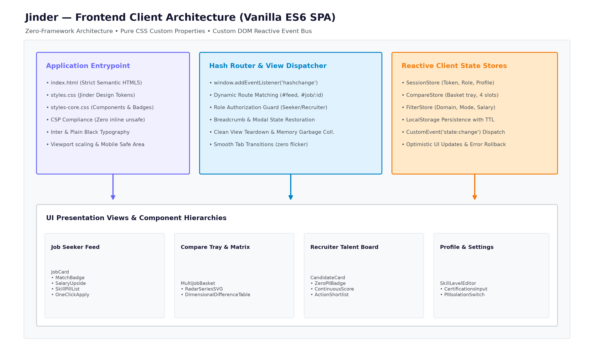
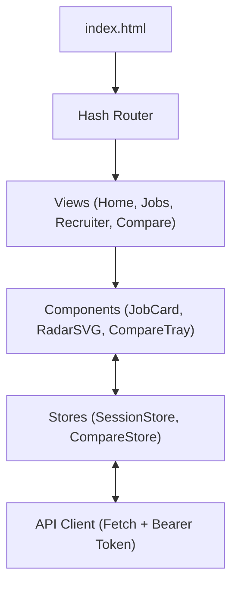

# Frontend Architecture Detail — Jinder Platform

> **Module Location:** `jinder_frontend/app/`  
> **Architecture Pattern:** Zero-Build Single Page Application (Vanilla ES6 Modules + CSS3 Tokens)  
> **Status:** Production Deployed  

---

## 1. Architectural Philosophy & Design Decisions

The Jinder frontend is engineered with three core architectural constraints:
1. **Zero-Build Native Web Standards:** Uses standard ES6 `import` / `export` syntax directly in modern browsers. No Node.js build pipeline, Webpack, Vite, or Babel required for deployment.
2. **Strict Content Security Policy (CSP) Compliance:**
   - No inline styles (`style="..."` attributes are strictly prohibited).
   - No inline scripts (`<script>...</script>` or `onclick="..."` event attributes are banned). All event binding is done via `addEventListener` in JavaScript controllers.
3. **Reactive In-Memory State Containers:** Unidirectional data flow managed by explicit singleton stores (`Session`, `CompareStore`) with pub/sub event broadcasting.

### Frontend Architecture Blueprint




---

## 2. Directory Layout & Module Structure

```
jinder_frontend/app/
├── index.html                 # Root HTML shell, meta tags, SVG icon defs, SPA mount point
├── styles.css                 # Master CSS entry importing core, views, and components
├── styles-core.css            # Design tokens, CSS variables, typography, reset, grid
├── styles-talent.css          # Candidate feed, job cards, drawer, fit score badges
├── styles-employer.css        # Employer dashboard, candidate cards, wildlife badges
├── styles-compare.css         # Multi-candidate & multi-job side-by-side matrix styles
├── logo.svg                   # Brand mark (swiped card overlapping geometry)
├── icons.svg                  # SVG symbol sprite sheet
└── js/
    ├── main.js                # App entrypoint: initializes router, session, and components
    ├── config.js              # Environment settings, API base URL (/api)
    ├── core/                  # Core infrastructure
    │   ├── router.js          # Hash-based client router (#/home, #/jobs, #/compare, etc.)
    │   ├── session.js         # User authentication, JWT storage, role state (Talent/Employer)
    │   ├── compare-store.js   # Reactive store for 2-5 side-by-side comparison items
    │   ├── dom.js             # Type-safe DOM helper utilities ($el, sanitizeHTML)
    │   └── forms.js           # Form validation and serialization helpers
    ├── api/                   # Networking & data access layer
    │   ├── http.js            # Fetch wrapper with Bearer token injection & error normalizer
    │   ├── errors.js          # Standardized error codes (TOO_LARGE, RATE_LIMITED, etc.)
    │   ├── index.js           # High-level API client methods (auth, jobs, talents, compare)
    │   └── mock/              # In-browser mock backend for offline demos (?mock=1)
    ├── components/            # Reusable UI widgets
    │   ├── shell.js           # Navigation bar, user menu, active view switcher
    │   ├── job-card.js        # Job requisition card with live fit score
    │   ├── profile-card.js    # Anonymized talent card with wildlife animal avatar
    │   ├── compare-tray.js    # Floating dock displaying selected items for comparison
    │   ├── radar.js           # Pure SVG skill radar chart generator
    │   ├── charts.js          # Pure SVG horizontal skill breakdown bar charts
    │   ├── modal.js           # Accessible modal dialogue controller
    │   └── pagination.js      # Pagination controls (10, 20, 50 items/page)
    └── views/                 # Top-level screen controllers
        ├── landing.js         # Public landing page with role selector
        ├── auth.js            # Login & registration controller
        ├── home.js            # Personalized discovery feed for Talent
        ├── jobs.js            # Search, filter, and drawer view for jobs
        ├── recruiter.js       # Employer dashboard: post job, manage applicants
        ├── compare.js         # Side-by-side comparison matrix (2-5 items)
        ├── applications.js    # Candidate application tracking status
        └── settings.js        # Account settings, de-identification toggles
```

---

## 3. State Management & Unidirectional Data Flow

### 3.1 Session Store (`core/session.js`)
Manages authentication credentials and role authorization:
```
+-------------------------------------------------------------+
|                        Session Store                        |
|  - token: string | null                                     |
|  - user: { id, email, role: 'talent' | 'employer' }         |
|  - isAuthenticated(): boolean                               |
+-------------------------------------------------------------+
               |                               |
       (Dispatches Events)             (Reads State)
               v                               v
         Shell Component                 Router Guards
    (Updates User Avatar)          (Redirects if unauthorized)
```

### 3.2 Compare Store (`core/compare-store.js`)
Handles the multi-entity comparison tray (2 to 5 items):
- Supports `add(item)`, `remove(id)`, `clear()`, `getItems()`.
- Validates limits: Minimum 2 items to compare, Maximum 5 items.
- Enforces role boundaries:
  - **Talent:** Compares 2–5 **Jobs** (Free).
  - **Employer:** Compares 2–5 **Talent Profiles** (Premium feature).

---

## 4. Routing Architecture (`core/router.js`)

Uses HTML5 Hash Routing (`window.location.hash`) for zero-server rewrite dependency:
- `#/` -> `LandingView`
- `#/auth` -> `AuthView`
- `#/home` -> `HomeView` (Requires `role == 'talent'`)
- `#/jobs` -> `JobsView`
- `#/recruiter` -> `RecruiterView` (Requires `role == 'employer'`)
- `#/compare` -> `CompareView`
- `#/applications` -> `ApplicationsView`

Before navigating to any view, `router.js` checks authentication and role permissions. Unauthorized access redirects immediately to `#/auth`.

---

## 5. Visual Styling & Modern Jinder Theme Tokens

All styling is centralized in `styles-core.css` using native CSS Custom Properties:
- **Canvas Base:** `#0B0F19` (Modern Dark Navy)
- **Surfaces:** `#111827` (Card Dark), `#1F2937` (Elevated Surface)
- **Primary Accent:** `#6868F7` (Violet Indigo) with gradient `linear-gradient(135deg, #6868F7 0%, #8E8EFC 100%)`
- **Secondary Accent:** `#FFA340` (Warm Coral)
- **Status Mint:** `#10B981` (Verified Match / Active)
- **Micro-animations:** `cubic-bezier(0.16, 1, 0.3, 1)` transitions for silky tab switches, drawer slide-overs, and card hover lifts.

---

## 6. Standalone Presentation & Administrative Portals

Beyond the core SPA, the frontend architecture encompasses two standalone HTML5 web applications built with the exact same design system tokens and zero build requirements:

### 6.1 Canonical Formulas Technical Deck (`Presentation/formulas_presentation.html`)
- **100vh Single-Screen Design:** 0 vertical scrolling; all 6 formulas visible concurrently in an executive 3×2 grid.
- **Interactive Parameter Workbench:** Left-hand simulation panel featuring smooth continuous gradient sliders (`#6868f7` $\to$ `#a855f7` $\to$ `#ffa340`), real-time calculation, and step-by-step arithmetic verification.
- **KaTeX Vector Equations:** High-fidelity typographic rendering of mathematical formulas with styled variable badges.
- **Standards:** 100% Australian English (`en-AU`), Talent / Employer terminology, and official Jinder SVG vector branding.

### 6.2 Admin Control Center & Data Flow Telemetry (`Presentation/admin.html` & `app/admin.html`)
- **Live SQLite WAL Telemetry:** Real-time database metrics (page counts, WAL file size, journal mode) and verified user breakdown (**51 Talents**, **1 Demo Employer**).
- **Interactive 5-Stage Data Flow Pipeline Chart:** Real-time visual pipeline (Ingestion $\to$ Taxonomy Translation $\to$ Mathematical Engine $\to$ SQLite WAL $\to$ Shortlist Delivery) with clickable stage inspection.
- **22 Tables SQLite Explorer:** Tabular explorer with instant search, schema viewer, and pagination across all 22 database tables.
- **Safe SQL Runner:** In-browser query terminal with read-only validation.

