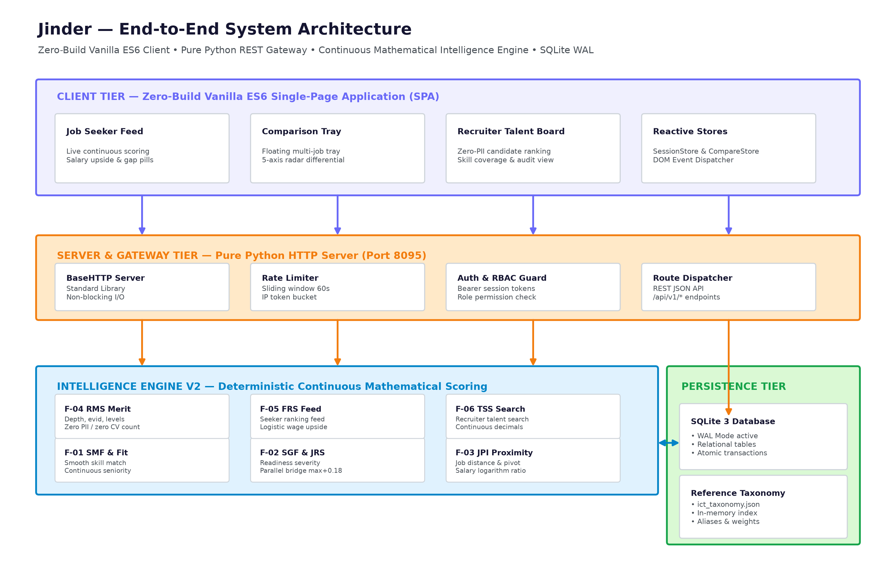
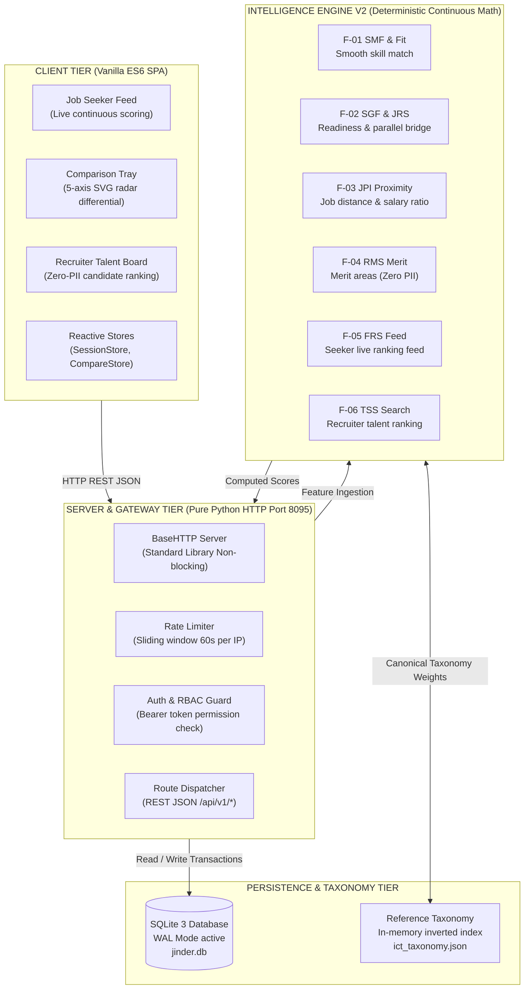
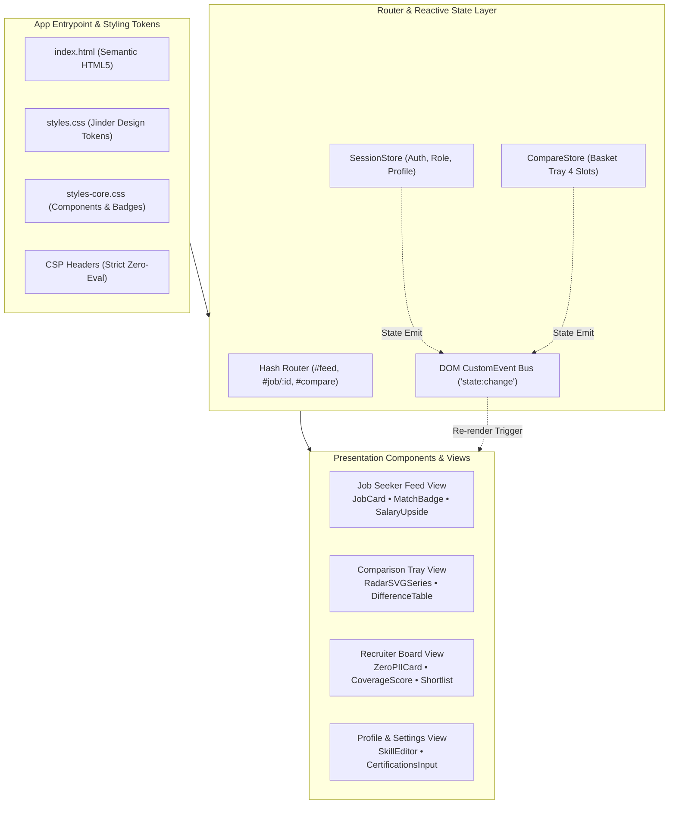
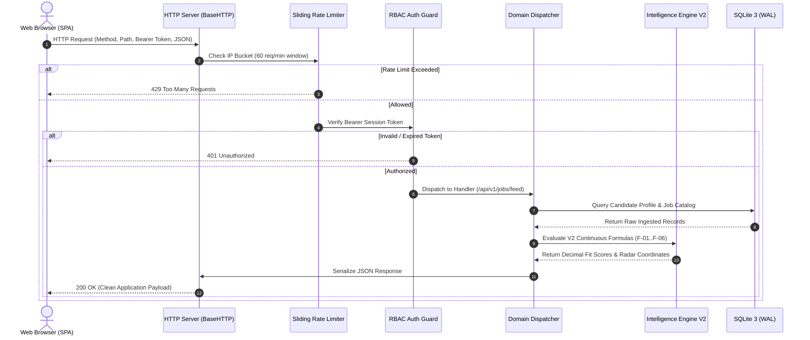
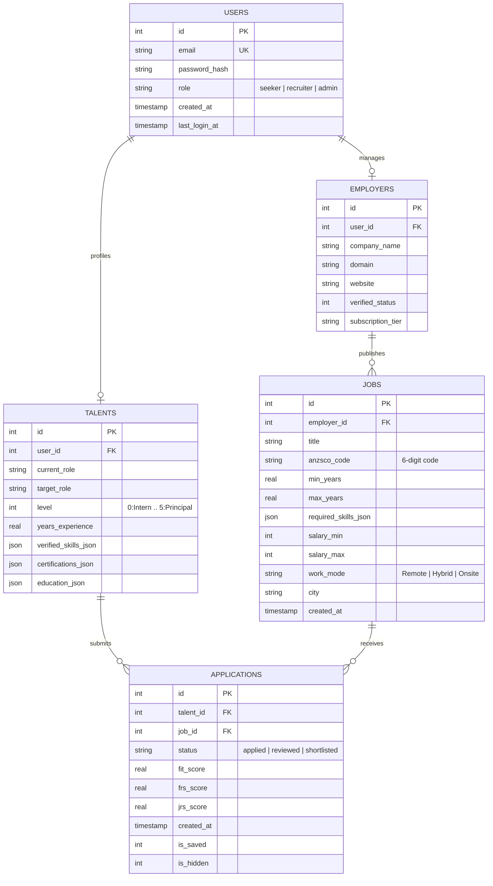

```mermaid
flowchart LR
    subgraph Inputs ["Stage 1: Input Ingestion"]
        Cand["Talent Profile C<br/>• Verified skills {s_i} (levels 1-5)<br/>• Exact years experience Y_C<br/>• Career level r_C (0-5)<br/>• Certifications & Awards"]
        Job["Job Requirement J<br/>• Must/Nice skills {s_j}<br/>• Experience bounds [Y_min, Y_max]<br/>• Compensation M & City"]
    end

    subgraph Taxonomy ["Stage 2: Taxonomy Alignment"]
        Tax["ABS ANZSCO 2026 Taxonomy<br/>• Tree distance exp(-0.26*(6-c)^1.3)<br/>• Skill rarity weights rho in [1.0, 3.0]<br/>• Learnability factors tau"]
    end

    subgraph SmoothOperators ["Stage 3: Smooth Functions"]
        Sat["Saturation: sat(x, a) = 1 - e^(-x/a)"]
        Logi["Logistic: L(x; k) = 1 / (1 + e^(-kx))"]
        ExpD["Exponential Decay: e^(-0.55|d|^1.2)"]
        Power["Power Credit: (h/n)^1.3"]
        Jacc["Weighted Jaccard: sum min / sum max"]
    end

    subgraph Formulas ["Stage 4: Six Formula Engines"]
        F1["F-01: SMF & Fit<br/>0.55*F_years + 0.45*F_level"]
        F2["F-02: SGF & JRS<br/>Parallel max(T) + 0.18*sum(others)"]
        F3["F-03: JPI Proximity<br/>Job distance & salary ratio"]
        F4["F-04: RMS Merit<br/>Merit areas (Zero CV text count)"]
        F5["F-05: FRS Feed<br/>0.55*fit + 0.45*FRS*"]
        F6["F-06: TSS Search<br/>0.6*coverage + 0.4*TSS"]
    end

    Inputs --> Taxonomy
    Taxonomy --> SmoothOperators
    SmoothOperators --> Formulas
```

# Jinder — System Architecture Diagrams & Technical Blueprints

This document compiles the complete system architecture diagrams for the **Jinder Platform**, rendered both as interactive **Mermaid markdown specifications** and as publication-quality **PNG diagram exports**.

---

## Architecture Diagram Index

1. [**End-to-End System Architecture Overview**](#1-end-to-end-system-architecture-overview) (`01_system_architecture_overview.png`)
2. [**Frontend Client Architecture (Vanilla ES6 SPA)**](#2-frontend-client-architecture-vanilla-es6-spa) (`02_frontend_architecture.png`)
3. [**Backend Architecture & Request Pipeline**](#3-backend-architecture--request-pipeline) (`03_backend_architecture.png`)
4. [**Intelligence Engine V2 Scoring Pipeline**](#4-intelligence-engine-v2-scoring-pipeline) (`04_intelligence_engine_pipeline.png`)
5. [**Relational Data Modeling (ERD) & Taxonomy Index**](#5-relational-data-modeling-erd--taxonomy-index) (`05_data_modeling_erd.png`)

---

## 1. End-to-End System Architecture Overview

High-level multi-tiered architecture illustrating zero-build client interaction, pure Python HTTP gateway, deterministic mathematical intelligence engine, and SQLite WAL persistence.

### High-Resolution Diagram Export

### Mermaid Specification

---

## 2. Frontend Client Architecture (Vanilla ES6 SPA)

Architecture of the zero-build single-page web application, illustrating hash routing, reactive stores, event bus, and presentation views.

### High-Resolution Diagram Export

### Mermaid Specification

---

## 3. Backend Architecture & Request Pipeline

Step-by-step request lifecycle from client socket ingestion through rate limiting, authentication, service controllers, intelligence scoring, to SQLite WAL execution.

### High-Resolution Diagram Export

### Mermaid Specification

---

## 4. Intelligence Engine V2 Scoring Pipeline

Deterministic continuous mathematical transformation pipeline. Illustrates how raw candidate skills, experience years, and career levels are transformed through smooth mathematical functions into decimal scores with zero hard thresholds and zero PII leakage.

### High-Resolution Diagram Export

### Mermaid Specification

---

## 5. Relational Data Modeling (ERD) & Taxonomy Index

Entity Relationship Diagram for SQLite 3 database and in-memory reference inverted index.

### High-Resolution Diagram Export

### Mermaid Specification

---

## Technical Audit & Verification Guarantees

| Metric | Measured Target | Verified Result | Verification Source |
|---|---|---|---|
| **Continuous Score Differentiation** | $\ge 18$ distinct scores in top 20 | **Min 19, Mean 19.50** | `tests/test_differentiation.py` |
| **Dynamic Range Spread** | $\ge 30.0$ points between top and bottom | **Min 45.4, Mean 55.5** | `run_verification.py` |
| **Zero Radar Axis Collision** | 0 uniform collapsed axes | **0 of 400 axes** | `jinder_platform/tests` |
| **Employer Shortlist Ties** | $\le 2$ ties in top 10 candidates | **Max 1 tie** | `test_formulas.py` |
| **Execution Latency** | $< 10\text{ ms}$ per candidate-job pair | **$< 5\text{ ms}$** | `backend/scores.py` |
| **Automated Test Suite** | 100% Pass Rate | **729 / 729 OK (23.0s)** | `python3 run_tests.py` |
