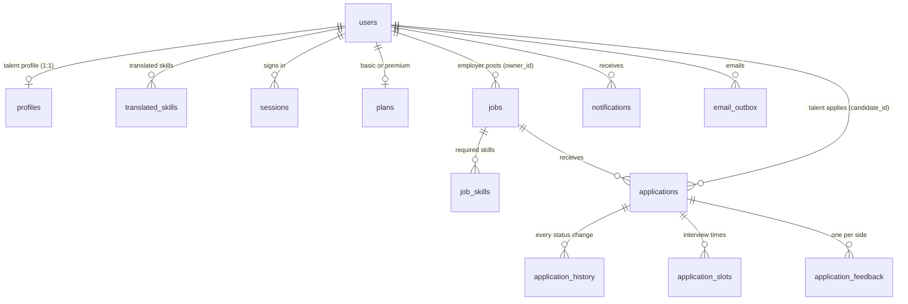

# Data Modeling Architecture Detail — Jinder Platform

> **Database engine:** SQLite 3, WAL mode, foreign keys on
> **Schema version:** 2 (row `schema_version` in `schema_info`)
> **Location:** `jinder_platform/var/jinder.db` (uploaded files in `jinder_platform/var/uploads/`)
> **Source of truth:** [`jinder_platform/jinder/schema.sql`](../../jinder_platform/jinder/schema.sql). If this page and `schema.sql` differ, `schema.sql` is correct.
> **Related:** [Data flow](DATA_FLOW_ARCHITECTURE.md), [Cloud migration plan](CLOUD_MIGRATION_PLAN.md), [`jinder_platform/docs/DATABASE.md`](../../jinder_platform/docs/DATABASE.md).

---

## 1. Entity relationship diagram


Source of the diagram: [`diagrams/05_data_modeling_erd.html`](diagrams/05_data_modeling_erd.html) (built from `schema.sql`).

Main relationships:



Notes:
- There is **no separate `talents` or `employers` table**. Both are rows in `users`; `role` is `candidate` (talent) or `recruiter` (employer). A talent has one row in `profiles`. An employer has its company in `users.company`.
- A job with `owner_id = NULL` is a catalogue job (no employer account owns it).
- The API values `candidate` and `recruiter` are kept in the data. The UI shows "Talent" and "Employer".

---

## 2. Tables (22)

| Group | Table | Purpose | Key rules |
|---|---|---|---|
| Accounts | `users` | One row for each talent or employer | `email` unique (lower case); `alias` unique, case-insensitive (talent only); `password_hash` is scrypt, `!` = cannot sign in; `is_sample = 1` for sample profiles |
| | `sessions` | Sign-in sessions | Key = SHA-256 of the token. The token itself is never stored |
| | `plans` | `basic` or `premium` for a user | One row for each user |
| | `schema_info` | Database metadata | `schema_version = 2`, seed version |
| Talent profile | `profiles` | The private profile | Lists are JSON text; `evidence` and `study_country` are private |
| | `translated_skills` | One row for each translated skill, with the talent's decision | Only `accepted` and `edited` rows are shared |
| | `cv_files` | Uploaded CV files | The file is in `var/uploads/`, never served to employers |
| | `parses` | Background read of a CV or a job description | `kind` = `cv` or `jd`; `status` = `parsing`, `done`, `failed` |
| Jobs | `jobs` | Catalogue jobs and employer jobs | Open or closed comes from `closes_at`; description ≤ 10,000 characters |
| | `job_skills` | Skills of a job, in order | `level` 1–5; `must` = 1 required, 0 nice to have |
| Actions | `bookmarks`, `skips` | What a talent saves or hides | Key = (user, job) |
| | `saved_candidates`, `skipped_candidates` | What an employer saves or hides | Key = (employer, talent) |
| | `reports` | Reports from both sides | One report for each (user, target type, target) |
| Hiring | `applications` | One row for each talent and job | `UNIQUE (job_id, candidate_id)`; frozen `snapshot` and `match_json` |
| | `application_history` | Every status change | Status, time, actor role, note |
| | `application_slots` | Interview times (1 to 3) | Times in UTC |
| | `application_feedback` | Final feedback of each side | `to_other` (the other side), `to_team` (Jinder team only) |
| Alerts and events | `notifications` | In-app notifications | `email` flag, `read` flag |
| | `events` | Tracking events | Counts only; never shown per person to the other side |
| | `email_outbox` | Email queue | `pending`, `sent`, `failed`, `recorded`; retry with backoff |

---

## 3. Core tables

### 3.1 `users`

| Column | Type | Notes |
|---|---|---|
| `id` | TEXT, PK | |
| `role` | TEXT | `candidate` or `recruiter` (CHECK) |
| `name` | TEXT | Private |
| `email` | TEXT, UNIQUE | Lower case. Private |
| `company` | TEXT | Employers only |
| `alias` | TEXT, NOCASE | Talent only. Unique index on `alias` |
| `password_hash` | TEXT | scrypt hash; `!` = the account cannot sign in |
| `onboarding` | TEXT | `done` or `dismissed` |
| `is_sample` | INTEGER | 1 = sample talent profile |
| `created_at` | TEXT | ISO 8601, UTC |

### 3.2 `profiles` (private, one row for each talent)

| Column | Type | Notes |
|---|---|---|
| `user_id` | TEXT, PK, FK → users | 1:1 |
| `qualification`, `field_of_study` | JSON list | |
| `study_country` | JSON list | **Private.** Used only for the AQF note. Never shared, never used to rank |
| `current_role`, `industry` | JSON list | |
| `skills` | JSON list | The talent's own skill words |
| `target_role`, `target_industries`, `locations`, `work_types`, `work_modes` | JSON list | Goals and preferences |
| `level` | TEXT | `''` or Intern, Junior, Mid, Senior, Lead, Principal (CHECK) |
| `years_exact` | REAL | 0 to 40; `years` (text band) is set from it |
| `specialisation` | TEXT | A specialisation of the domain (taxonomy) |
| `certifications` | JSON | `[{name, issuer, year}]` |
| `awards` | JSON | `[{name, kind, year}]` |
| `evidence` | JSON list | **Private.** CV lines that support the skills |
| `updated_at` | TEXT | |

### 3.3 `translated_skills`

| Column | Type | Notes |
|---|---|---|
| `user_id`, `skill_id` | TEXT, PK | `user_id` FK → users |
| `position` | INTEGER | Order on the screen |
| `source` | TEXT | `role`, `skill` or `qualification` |
| `original` → `mapped` | TEXT | What the talent wrote → the Australian skill (or AQF level) |
| `kind` | TEXT | `cross-border`, `cross-industry` or `direct` |
| `anzsco`, `occupation` | TEXT | For role mappings |
| `reason` | TEXT | Plain-language reason |
| `evidence` | TEXT | `Strong`, `Moderate` or `Limited` (evidence of one skill, not a score on the person) |
| `evidence_text` | TEXT | A CV line, or empty |
| `status` | TEXT | `suggested`, `accepted`, `edited` or `removed` |
| `level`, `years` | INTEGER 1–5, REAL 0–40 | Skill rows only |

### 3.4 `jobs` and `job_skills`

| Column | Type | Notes |
|---|---|---|
| `id` | TEXT, PK | `job-<key>` |
| `owner_id` | TEXT, FK → users | `NULL` = catalogue job; ON DELETE SET NULL |
| `title`, `company`, `category`, `location`, `area`, `type` | TEXT | |
| `level`, `specialisation` | TEXT | Taxonomy values, or NULL |
| `min_years`, `max_years` | REAL | 0 to 40; no maximum means "or more" |
| `work_mode` | TEXT | `Onsite`, `Hybrid` or `Remote` |
| `salary_min`, `salary_max`, `salary_unit` | REAL, REAL, TEXT | Stored as given (`year`, `day`, `hour`); only the formulas change it to a yearly pay |
| `summary`, `description` | TEXT | ≤ 200 and ≤ 10,000 characters |
| `certs_required`, `certs_preferred`, `awards_preferred` | JSON list | |
| `target_applicants` | INTEGER | |
| `posted_at`, `closes_at`, `edited_at`, `created_at` | TEXT | |

`job_skills`: `(job_id, position)` PK, `skill` (taxonomy name), `level` 1–5, `must` (1 required, 0 nice to have).

### 3.5 `applications` and the hiring tables

| Column | Type | Notes |
|---|---|---|
| `id` | TEXT, PK | |
| `job_id` | TEXT | The job |
| `candidate_id`, `recruiter_id` | TEXT, FK → users | Talent and employer |
| `origin` | TEXT | `applied` or `contacted` (Premium invitation) |
| `status` | TEXT | See 3.6 (CHECK) |
| `note`, `message` | TEXT | Contact details are removed before the other side reads them |
| `snapshot` | JSON | **Frozen copy of the shared profile** at the time of applying. Never the CV |
| `match_json` | JSON | `{coverage, skills[]}` against the snapshot |
| `chosen_slot_id`, `slot_confirmed` | TEXT, INTEGER | Interview slot |
| `identity_shared` | INTEGER | 1 = the talent agreed to share name and email |
| `offer_text`, `offer_sent_at` | TEXT | |
| `created_at`, `updated_at` | TEXT | |

`UNIQUE (job_id, candidate_id)`: one application for each talent and job.
`application_history`: `id` (AUTOINCREMENT), `application_id`, `status`, `at`, `actor` (`candidate`, `recruiter`, `system`), `note`.
`application_slots`: `(application_id, id)` PK, `start` (UTC), `position` (1–3).
`application_feedback`: `(application_id, side)` PK, `to_other`, `to_team` (team only), `at`.

### 3.6 Application status values

| Status | Label in the UI | Allowed next status (set by the server) |
|---|---|---|
| `applied` | Applied | `review`, `rejected` |
| `contacted` | Contacted | `interview`, `rejected` |
| `review` | In review | `interview`, `rejected` |
| `interview` | Interview | `accepted`, `rejected` |
| `accepted` | Accepted | `offer`, `rejected` |
| `offer` | Offer | the talent answers: `confirmed` or `rejected` |
| `confirmed`, `rejected`, `declined` | Confirmed, Not selected, Declined | final |

Source: `TRANSITIONS` in `jinder_platform/jinder/routes/applications.py`.

---

## 4. JSON shapes

### 4.1 `applications.snapshot` (the shared profile)
Built by `store.shared_profile()`, the only function that makes an employer-safe profile:

```json
{
  "alias": "Teal Heron",
  "roles": [{ "title": "Data Analyst", "anzsco": "224114" }],
  "skills": ["SQL", "Python", "Power BI"],
  "qualifications": ["AQF Level 7"],
  "fieldsOfStudy": [], "industries": [], "years": "3–5 years",
  "targetRoles": [], "locations": [], "workTypes": [], "workModes": [],
  "specialisation": "Data engineering", "level": "Mid", "yearsExperience": 4.5,
  "skillLevels": [{ "name": "SQL", "level": 4, "years": 4 }],
  "certifications": [{ "name": "…", "issuer": "…", "year": 2024 }],
  "awards": [{ "name": "…", "kind": "…", "year": 2023 }],
  "updatedAt": "2026-10-06T03:45:04.120Z"
}
```
It never has the name, email, country of study, CV text or evidence lines. The values above are examples.

### 4.2 `applications.match_json` (per-skill match)

```json
{
  "coverage": 72,
  "skills": [
    { "name": "SQL", "status": "match", "fitStatus": "meets", "required": 3, "level": 4, "must": true, "reason": "Has this skill." },
    { "name": "Apache Airflow", "status": "gap", "fitStatus": "missing", "required": 2, "level": null, "must": true, "reason": "No evidence of this skill yet." }
  ]
}
```
`status` is `match`, `partial` or `gap`; `fitStatus` is `meets`, `below`, `related` or `missing` (from Formula 1). A `related` item also has `via`.

### 4.3 `parses.result` (CV or job description read)

```json
{ "fields": { "…": "…" }, "detected": ["currentRole", "skills"], "missing": ["years"], "evidence": ["…"] }
```
`detected` fields are marked "AI-detected" in the form; `missing` fields stay empty. A job description result has no `evidence`.

---

## 5. Rules in the data

1. **Privacy:** employer routes read a talent profile only through `store.shared_profile()`. Columns marked private in the diagram never leave it.
2. **Frozen at apply:** `applications.snapshot` and `match_json` do not change when the profile changes later.
3. **One application** for each talent and job (`UNIQUE`). **One alias** for each talent (unique, case-insensitive).
4. **State machine:** `status` has a CHECK on the values; the server checks every move and writes `application_history`.
5. **Delete:** deleting a user deletes the rows of the profile, sessions, applications and alerts (`ON DELETE CASCADE`). The "delete my account" route also deletes the CV files in `var/uploads/`. A job of a deleted employer keeps its row (`owner_id` becomes NULL).
6. **Taxonomy:** names come from `ict_taxonomy.json`. A value that is not in the taxonomy is cleaned when it is saved.
7. **Facts only:** scores are computed by the formulas on each request. They are never stored.

---

## 6. Taxonomy in memory

`jinder_platform/jinder/taxonomy.py` loads `jinder_backend_engine/data/reference/ict_taxonomy.json` once and keeps lookup tables in memory: levels, skill levels, domains and specialisations, skill groups, skills (`skill_by_name`), occupations by ANZSCO code, certifications, award kinds, roles (`role_by_title`), fields of study, cities, work modes and work types. The API, the CV and JD readers and the formulas use the same names from this one source.

---

## 7. Versions and migration

- `schema.sql` runs at each start. Every statement is safe to run again.
- A database with a lower schema version is **not changed**. It is renamed to `jinder.db.v1.bak` (and `uploads` to `uploads.v1.bak`), and a new database is made. Nothing is deleted.
- `SEED_VERSION = "2"` in `seed.py`: a database seeded with an older version gets the new catalogue jobs and talent profiles. Real accounts stay.
- Back up: stop the server and copy `var/jinder.db` and `var/uploads/`. Reset: `python start.py --reset-db`.
- Planned move to PostgreSQL and an S3 data lake (Bronze, Silver, Gold): see [CLOUD_MIGRATION_PLAN.md](CLOUD_MIGRATION_PLAN.md).

---

## 8. Database explorer (admin)

`Presentation/admin.html` (also `jinder_frontend/app/admin.html`) has a table explorer for the 22 tables, database statistics and a read-only SQL runner.

> **Warning:** the `/admin/*` API routes have **no access control** today. They can read every table, including private columns. Use them only on your own computer. See [GAP_ANALYSIS.md](../GAP_ANALYSIS.md), section 1.
