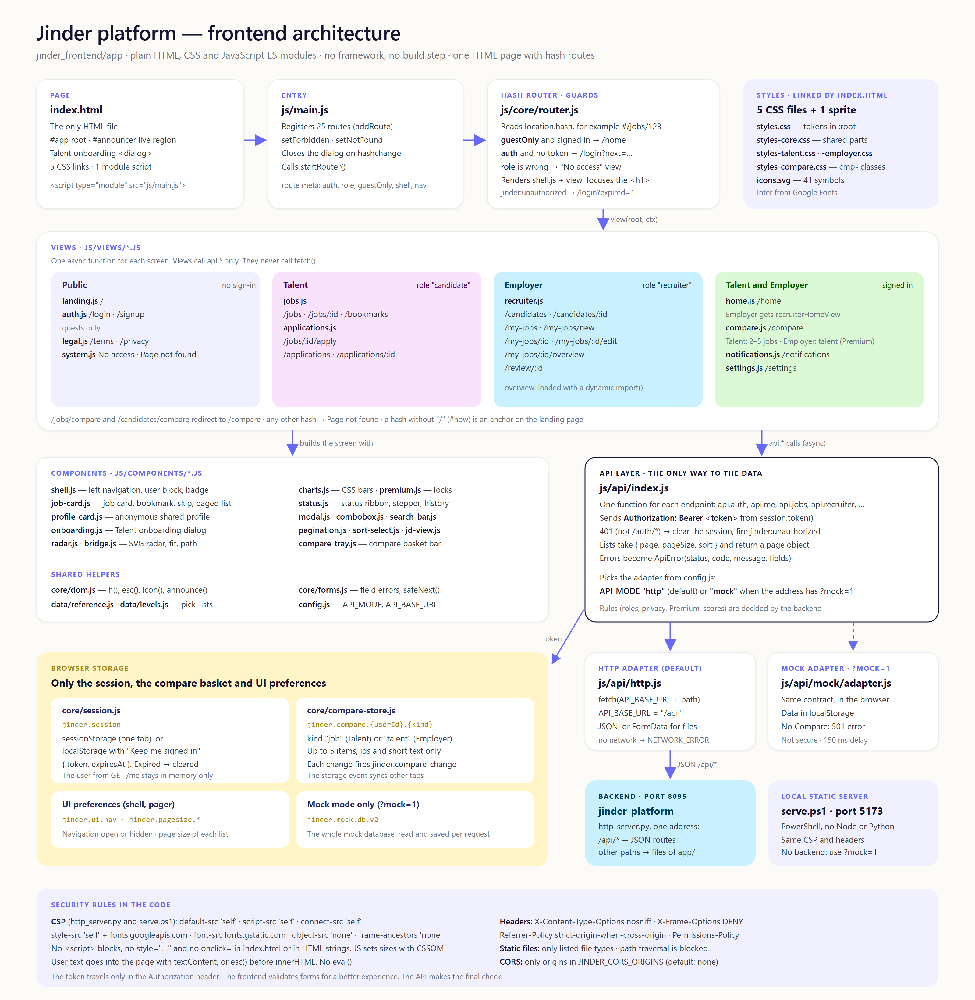

# Frontend Architecture Detail — Jinder Platform

> **Location:** `jinder_frontend/app/`
> **Type:** Single-page app. Plain HTML, CSS and JavaScript ES modules. No framework. No build step. No npm packages.
> **Contract:** `jinder_frontend/prompt.md` (architecture, routes, API contract). Rules: `jinder_frontend/AI_Rule.md`. Visual design: `jinder_frontend/Docs/DESIGN.md`.
> **Served by:** `jinder_platform/jinder/http_server.py` (port 8095).

---

## 1. Diagram



Source: [diagrams/02_frontend_architecture.html](diagrams/02_frontend_architecture.html). Open the file in a browser. To make the PNG again, use headless Chrome with a window of 1600 x 1640 and device scale 2.

---

## 2. Main rules

1. The app has one HTML file: `index.html`. The hash router renders every screen into `#app`.
2. The browser loads the JavaScript files as ES modules (`<script type="module" src="js/main.js">`). No tool compiles or bundles the code.
3. Views use `js/api/index.js` to read and write data. Views do not call `fetch()`.
4. The backend decides the rules: role checks, privacy, status changes, Premium access and match scores. The frontend validates forms only to help the user. Then it shows the API errors.
5. The code has no inline scripts, no `style="..."` attributes and no `onclick=` attributes in `index.html` or in HTML strings. JavaScript sets dynamic sizes through CSSOM (for example `el.style.width` in `job-card.js` and `onboarding.js`). The CSP allows this.
6. The UI says "Talent" and "Employer". The API keeps the role values `candidate` (Talent) and `recruiter` (Employer).

---

## 3. Files

```
jinder_frontend/app/
├── index.html            The only HTML page: skip link, #app root, #announcer live region,
│                         Talent onboarding <dialog>, 5 CSS links, 1 module script
├── styles.css            Base styles. Design tokens as CSS custom properties in :root
├── styles-core.css       Shared parts: extra tokens, Premium markers, pager, sort select,
│                         JD box, compare tray, radar series, user block, plan card
├── styles-talent.css     Talent parts: job card facts, job detail, "Your path", onboarding, profile card
├── styles-employer.css   Employer parts: lists, talent card and detail, job form, job overview
├── styles-compare.css    The Compare page (class names start with cmp-)
├── icons.svg             SVG sprite: the logo symbol and the UI icons (41 symbols)
├── logo.svg              Standalone logo (favicon)
├── serve.ps1             Local static server in PowerShell (port 5173)
├── admin.html            Standalone admin page (see section 11). Not part of the SPA
└── js/
    ├── main.js           Registers the routes and starts the router
    ├── config.js         API_MODE ("http", or "mock" with ?mock=1), API_BASE_URL ("/api"), mock settings
    ├── core/
    │   ├── router.js         Hash router, auth and role guards, focus management
    │   ├── session.js        Session token storage and the cached user
    │   ├── compare-store.js  The compare basket (localStorage, window event)
    │   ├── dom.js            h(), icon(), iconHtml(), esc(), toList(), formatDate(), announce(), logoHtml()
    │   └── forms.js          isEmail(), fieldError(), clearErrors(), showAlert(), applyFieldErrors(),
    │                         enhanceForm(), safeNext()
    ├── api/
    │   ├── index.js          The API layer: one function for each endpoint
    │   ├── http.js           Adapter for the real backend (fetch)
    │   ├── errors.js         ApiError(status, code, message, fields, { suggestion, missing })
    │   └── mock/             Mock backend in the browser (adapter.js, core.js, db.js, routes-*.js and data files)
    ├── data/
    │   ├── reference.js      Pick-lists: domains, specialisations, roles, cities, certifications, skills, ...
    │   └── levels.js         LEVELS, SKILL_LEVELS, WORK_MODES, PAGE_SIZES [10, 20, 50], COMPARE_MAX (5)
    ├── components/           16 files (see section 6)
    └── views/                11 files (see section 5)
```

---

## 4. Start-up and routing

### 4.1 Start-up

1. The browser loads `index.html`. It loads the 5 CSS files in this order: `styles.css`, `styles-core.css`, `styles-talent.css`, `styles-employer.css`, `styles-compare.css`.
2. `index.html` loads `js/main.js` as a module.
3. `main.js` registers 25 routes with `addRoute(pattern, view, meta)`.
4. `main.js` sets the "No access" view (`setForbidden`) and the "Page not found" view (`setNotFound`).
5. `main.js` closes the onboarding dialog on each `hashchange`.
6. `main.js` calls `startRouter()`.

### 4.2 Router (`js/core/router.js`)

The router reads `location.hash`. A hash that starts with `/` is a route, for example `#/jobs/123?tab=skills`. A hash without `/` (for example `#how`) is an anchor on the landing page.

Each route has `meta = { title, auth, role, guestOnly, shell, nav, bodyClass }`. The router checks the route in this order:

1. No route matches: the router shows "Page not found".
2. `guestOnly` and the user is signed in: the router goes to `/home`.
3. `auth` and there is no token: the router goes to `/login?next={path}`.
4. `auth` and no cached user: the router calls `api.me.get()` first.
5. `role` and the user has a different role: the router shows "No access" inside the shell.

Then the router renders the view:

- It sets `document.title` to "{title} — Jinder".
- It sets `document.body.className` to `meta.bodyClass`.
- If `meta.shell` is true, it renders `components/shell.js` and puts the view inside it.
- It calls `view(root, ctx)`. `ctx` has `params`, `query`, `path`, `user` and `navigate`.
- It scrolls to the top. It focuses the page `<h1>` (not on the landing page).
- It ignores a render when a newer navigation started (render id).

When the API layer fires `jinder:unauthorized`, the router goes to `/login?expired=1&next={path}`.

### 4.3 Routes

| Route | View function (file) | Access |
|---|---|---|
| `/` | `landingView` (landing.js) | Public |
| `/login` | `loginView` (auth.js) | Guests only |
| `/signup` | `signupView` (auth.js) | Guests only |
| `/terms` | `termsView` (legal.js) | Public |
| `/privacy` | `privacyView` (legal.js) | Public |
| `/home` | `homeView` (home.js). An Employer gets `recruiterHomeView` (recruiter.js) | Signed in, both roles |
| `/settings` | `settingsView` (settings.js) | Signed in, both roles |
| `/compare` | `compareView` (compare.js). The page decides by the role | Signed in, both roles |
| `/notifications` | `notificationsView` (notifications.js) | Signed in, both roles |
| `/jobs/compare` | Redirect to `/compare` (keeps `ids`) | Signed in |
| `/candidates/compare` | Redirect to `/compare` (`a`, `b` become `ids`, keeps `jobId`) | Signed in |
| `/jobs` | `jobsView` (jobs.js) | Talent |
| `/jobs/:id` | `jobDetailView` (jobs.js) | Talent |
| `/jobs/:id/apply` | `applyView` (applications.js) | Talent |
| `/bookmarks` | `bookmarksView` (jobs.js) | Talent |
| `/applications` | `applicationsView` (applications.js) | Talent |
| `/applications/:id` | `applicationDetailView` (applications.js) | Talent |
| `/candidates` | `candidatesView` (recruiter.js) | Employer |
| `/candidates/:id` | `candidateDetailView` (recruiter.js) | Employer |
| `/my-jobs` | `myJobsView` (recruiter.js) | Employer |
| `/my-jobs/new` | `jobFormView` (recruiter.js) | Employer |
| `/my-jobs/:id` | `jobApplicationsView` (recruiter.js) | Employer |
| `/my-jobs/:id/edit` | `jobFormView` (recruiter.js) | Employer |
| `/my-jobs/:id/overview` | `jobOverviewView` (recruiter.js, loaded with a dynamic `import()`) | Employer |
| `/review/:id` | `reviewView` (recruiter.js) | Employer |
| Any other path | `notFoundView` (system.js) | Public |

"Talent" means the route has `role: "candidate"`. "Employer" means the route has `role: "recruiter"`.

---

## 5. Views (`js/views/`)

A view is an async function: `view(root, ctx)`. It builds one screen. It gets data with `api.*` calls.

| Group | Files |
|---|---|
| Public | `landing.js`, `auth.js`, `legal.js`, `system.js` (placeholder, "No access", "Page not found") |
| Talent | `jobs.js`, `applications.js` |
| Employer | `recruiter.js` |
| Talent and Employer | `home.js`, `compare.js`, `notifications.js`, `settings.js` |

The Compare page works in two ways:

- A Talent compares 2 to 5 jobs.
- An Employer compares 2 to 5 talent profiles for one own job (`jobId`). This is a Premium feature. The backend checks the plan.

---

## 6. Components (`js/components/`)

| File | What it does |
|---|---|
| `shell.js` | Left navigation (one menu for each role), user block (link to Settings), unread badge, mobile bell. It mounts the compare tray on all pages except Compare |
| `job-card.js` | Job card, bookmark button, skip ("Not for me") with undo, report dialog, `createPagedList()` |
| `profile-card.js` | Anonymous shared profile card |
| `onboarding.js` | Talent onboarding dialog. `home.js` and `settings.js` open it |
| `radar.js` | SVG radar chart for 1 to 5 series, and the same numbers as a table |
| `bridge.js` | "How this job fits you" and "Your path to this job" |
| `charts.js` | CSS bar charts and the Premium upgrade prompt |
| `status.js` | Status ribbon, stepper, history, per-skill match list |
| `modal.js` | Small dialog: `openModal()`, `radioGroup()`, `textArea()` |
| `combobox.js` | Searchable dropdown (WAI-ARIA combobox) |
| `search-bar.js` | Job search bar (keyword and location) |
| `pagination.js` | Pager. It saves the page size of each list |
| `sort-select.js` | Sort select |
| `jd-view.js` | Job description box |
| `premium.js` | Crown icon, Premium chip, lock badges, Premium dialog |
| `compare-tray.js` | The compare basket bar at the bottom of the main area |

---

## 7. API layer (`js/api/`)

### 7.1 `index.js`

- `index.js` exports `api`. It has these groups: `auth`, `me`, `cv`, `profile`, `aliases`, `jobs`, `reports`, `applications`, `recruiter` (`jobs`, `applications`, `candidates`, compare), `notifications`, `stats`, `entitlements`, `bookmarks`.
- Each function calls one endpoint of the API contract in `prompt.md`.
- `request()` gets the token from `session.token()` and gives it to the adapter.
- When a call returns 401 (not on `/auth/*`), `request()` clears the session. Then it fires the window event `jinder:unauthorized`.
- A list function takes `{ page, pageSize, sort }`. The real backend returns a `page` object. For the mock, `index.js` sorts and cuts the list in the browser and builds the same `page` object.
- `index.js` also exports `isSignedIn()` and `ApiError`.

### 7.2 Adapters

`config.js` sets `API_MODE`. `index.js` picks the adapter from it.

| | HTTP adapter (`http.js`) | Mock adapter (`mock/adapter.js`) |
|---|---|---|
| When | Default (`API_MODE "http"`) | The address has `?mock=1` |
| Where the data is | The backend, through `fetch(API_BASE_URL + path)`. `API_BASE_URL` is `/api` | Browser `localStorage`, key `jinder.mock.db.v2` |
| Request body | JSON, or `FormData` for file uploads | A copy of the body |
| Auth | `Authorization: Bearer <token>` header | The token goes to the mock route |
| Errors | `ApiError`. No network gives `NETWORK_ERROR` (status 0) | `ApiError`. An unknown endpoint gives 404 |
| Limits | None | Waits 150 ms for each request. Not secure. No Compare: the call fails with 501 `NEEDS_REAL_BACKEND` |

---

## 8. Browser state

The frontend has no state library and no reactive store. The app keeps state in these places:

| Module | Storage key | What it keeps |
|---|---|---|
| `core/session.js` | `jinder.session` | `{ token, expiresAt }`. It uses `sessionStorage` (one tab), or `localStorage` when the user ticks "Keep me signed in on this device". An expired token is cleared. The user from `GET /me` stays in memory only (`session.user`) |
| `core/compare-store.js` | `jinder.compare.{userId}.{kind}` (localStorage) | The compare basket. `kind` is `job` for a Talent and `talent` for an Employer. Up to 5 items. Each item has an id and short text only |
| `components/shell.js` | `jinder.ui.nav` (localStorage) | The navigation is open or hidden |
| `components/pagination.js` | `jinder.pagesize.*` (localStorage) | The page size of each list |
| Mock adapter only | `jinder.mock.db.v2` (localStorage) | The whole mock database |

`compareStore` has `items`, `count`, `has`, `add`, `remove`, `clear`, `kindForRole` and `max`. Each change fires the window event `jinder:compare-change` with `{ kind, items, action, id }`. A `storage` event from another tab fires the same event with `action: "sync"`.

---

## 9. Styles and design tokens

`styles.css` imports Inter from Google Fonts. It defines the tokens in `:root`. The four `styles-*.css` files load after it and add to it. Some real token values:

| Token | Value |
|---|---|
| `--primary`, `--ink` | `#151531` (navy) |
| `--canvas` | `#ffffff` |
| `--sand` (page background) | `#fdfbf8` |
| `--hairline` | `#e9ecef` |
| `--accent` / `--accent-tint` | `#6868f7` / `#f0f0fe` |
| `--orange` | `#ffa340` |
| Tint pairs | pink `#f9e2fb` / `#560059`, blue `#c9f0ff` / `#003d5a`, green `#daf9d4` / `#005900`, yellow `#fff5c7` / `#a68716` |
| `--font-display` | "Plain Black", then Inter |
| `--font-body` | Inter |
| `--ease` | `cubic-bezier(0.2, 0, 0, 1)` |

The style is flat: a warm sand page, white cards, navy ink and pastel tint chips. `Docs/DESIGN.md` has the full design system.

---

## 10. Serving and security

### 10.1 Servers

- **Backend (normal use).** `jinder_platform/jinder/http_server.py` serves the app and the API on one address. The default port is 8095 (`JINDER_PORT`). The default host is `127.0.0.1`. Paths that start with `/api` go to the API routes. Other paths go to the files of `jinder_frontend/app` (`JINDER_APP_DIR`). `/` gives `index.html`.
- **Local static server.** `serve.ps1` serves the app on port 5173 with PowerShell. It needs no Node and no Python. It has no backend, so use `?mock=1`. The `-ApiOrigin` option adds a backend origin to `connect-src`.

### 10.2 Rules in the code

| Rule | Where |
|---|---|
| CSP: `default-src 'self'; script-src 'self'; style-src 'self' https://fonts.googleapis.com; font-src https://fonts.gstatic.com; img-src 'self' data:; connect-src 'self'; object-src 'none'; base-uri 'self'; form-action 'self'; frame-ancestors 'none'` | `http_server.py` (`CSP`) and `serve.ps1` |
| SVG files get `default-src 'none'; style-src 'unsafe-inline'` | `http_server.py` (`SVG_CSP`) and `serve.ps1` |
| `X-Content-Type-Options: nosniff`, `X-Frame-Options: DENY`, `Referrer-Policy: strict-origin-when-cross-origin`, `Permissions-Policy: camera=(), microphone=(), geolocation=()` | `http_server.py` (`SECURITY_HEADERS`, on every response) |
| Only these file types are served: `.html .css .js .svg .png .jpg .ico .json`. A path outside the app folder gives 404 | `http_server.py` (`STATIC_TYPES`, `_handle_static`) |
| CORS only for origins in `JINDER_CORS_ORIGINS`. The default is none | `http_server.py` (`_cors`) |
| User text goes into the page with `textContent` (`h()`), or with `esc()` before `innerHTML` | `core/dom.js`, `AI_Rule.md` |
| No `eval()` and no `new Function()` | `AI_Rule.md`. No match in `js/` |
| The token goes only in the `Authorization` header | `api/http.js` |
| After sign-in, `safeNext()` accepts only paths that start with one `/` and are not `/login` or `/signup` | `core/forms.js` |

---

## 11. `admin.html`

`app/admin.html` is a standalone page. The SPA does not link to it, and the router does not know it.

- It has its own inline `<style>` and `<script>` blocks. It does not follow the "no inline code" rule of the SPA.
- It starts from data that is embedded in the file (`SNAPSHOT`).
- It calls the backend routes `/api/admin/overview`, `/api/admin/table-data`, `/api/admin/sql` and `/api/admin/action` (`jinder_platform/jinder/routes/admin.py`).
- The backend CSP has `script-src 'self'`. This value blocks inline scripts. Thus the script of `admin.html` cannot run when the backend serves the page with this CSP.
