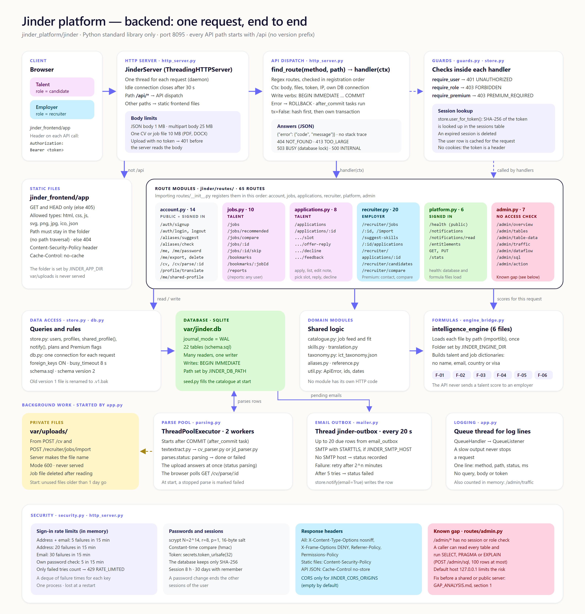
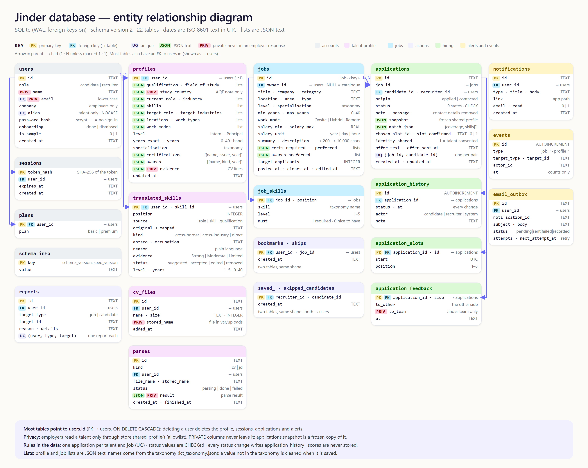
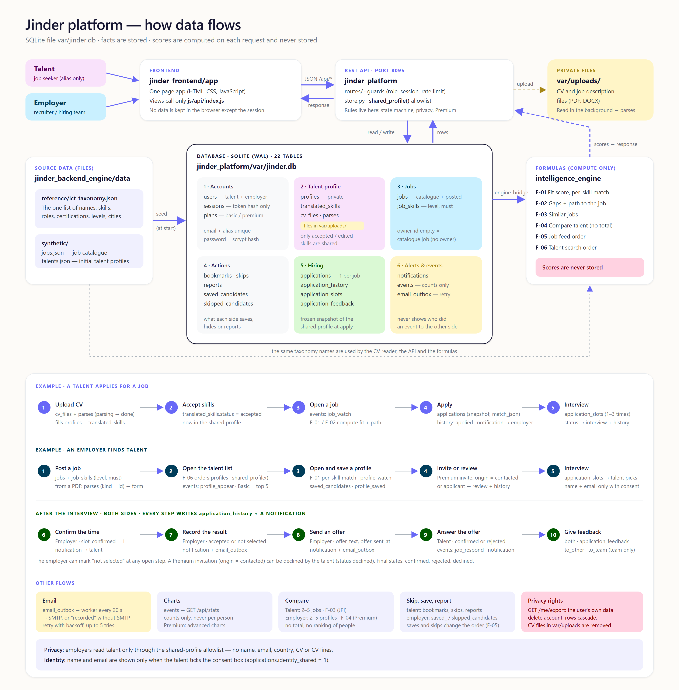
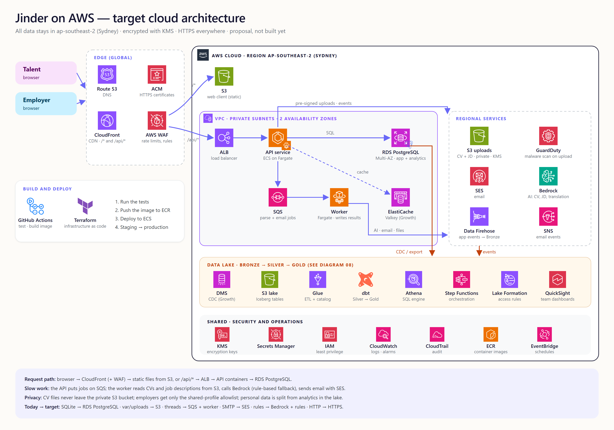
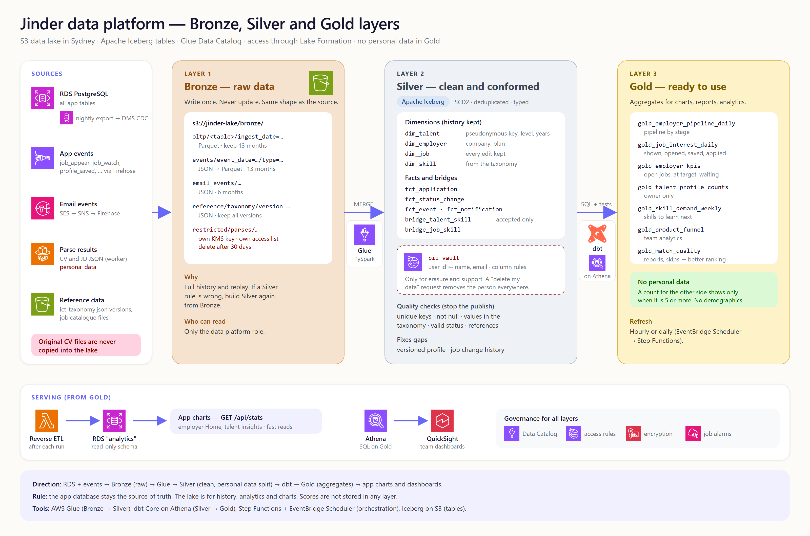

# Jinder — System Architecture Diagrams

This document is the index of the architecture diagrams of the Jinder platform.
Section 1 explains the end-to-end system.
The other sections link to the detail diagrams and their documents.

Every statement in section 1 agrees with the code in `jinder_frontend/app`, `jinder_platform/jinder` and `jinder_backend_engine`.

---

## Diagram index

| No. | Diagram | Image | Source | Detail document |
|---|---|---|---|---|
| 01 | End-to-end system architecture | [PNG](diagrams/01_system_architecture_overview.png) | [HTML](diagrams/01_system_architecture_overview.html) | This document, section 1 |
| 02 | Frontend architecture | [PNG](diagrams/02_frontend_architecture.png) | [HTML](diagrams/02_frontend_architecture.html) | [FRONTEND_ARCHITECTURE_DETAIL.md](FRONTEND_ARCHITECTURE_DETAIL.md) |
| 03 | Backend architecture | [PNG](diagrams/03_backend_architecture.png) | [HTML](diagrams/03_backend_architecture.html) | [BACKEND_ARCHITECTURE_DETAIL.md](BACKEND_ARCHITECTURE_DETAIL.md) |
| 04 | Intelligence engine pipeline | [PNG](diagrams/04_intelligence_engine_pipeline.png) | [HTML](diagrams/04_intelligence_engine_pipeline.html) | [FORMULA_ARCHITECTURE_DETAIL.md](FORMULA_ARCHITECTURE_DETAIL.md) |
| 05 | Data model (ERD) | [PNG](diagrams/05_data_modeling_erd.png) | [HTML](diagrams/05_data_modeling_erd.html) | [DATA_MODELING_ARCHITECTURE_DETAIL.md](DATA_MODELING_ARCHITECTURE_DETAIL.md) |
| 06 | Data flow | [PNG](diagrams/06_data_flow.png) | [HTML](diagrams/06_data_flow.html) | [DATA_FLOW_ARCHITECTURE.md](DATA_FLOW_ARCHITECTURE.md) |
| 07 | Cloud architecture (plan) | [PNG](diagrams/07_cloud_architecture.png) | [HTML](diagrams/07_cloud_architecture.html) | [CLOUD_MIGRATION_PLAN.md](CLOUD_MIGRATION_PLAN.md) |
| 08 | Medallion data layers (plan) | [PNG](diagrams/08_medallion_data_layers.png) | [HTML](diagrams/08_medallion_data_layers.html) | [CLOUD_MIGRATION_PLAN.md](CLOUD_MIGRATION_PLAN.md) |

---

## 1. End-to-end system architecture

Source: [diagrams/01_system_architecture_overview.html](diagrams/01_system_architecture_overview.html).
To make the PNG again, open the HTML file in headless Chrome with a window of 1600 x 1340 and a device scale factor of 2.

### 1.1 The parts

The system has four parts:

1. **Web client** — `jinder_frontend/app`. It runs in the browser.
2. **REST API** — `jinder_platform/jinder`. It is one Python process.
3. **Storage** — the SQLite file `jinder_platform/var/jinder.db` and the folder `jinder_platform/var/uploads/`.
4. **Formulas and reference data** — `jinder_backend_engine/intelligence_engine` and `jinder_backend_engine/data/reference/ict_taxonomy.json`.

There are two user roles: **Talent** and **Employer**.
In the code, the role values are `candidate` and `recruiter` (`schema.sql`, table `users`).

### 1.2 One process, one port

- The command `python start.py` (folder `jinder_platform`) starts the platform.
- The default address is `127.0.0.1`. The default port is `8095` (`config.py`). The variables `JINDER_HOST` and `JINDER_PORT` change them.
- The same process serves the web client files and the REST API.
- A path that starts with `/api/` goes to the API router. The API prefix is `/api`. There is no version part in the path.
- Any other path is a static file from `jinder_frontend/app`. Only the types `.html`, `.css`, `.js`, `.svg`, `.png`, `.jpg`, `.ico` and `.json` are served.
- The platform uses only the Python standard library (`requirements.txt`). The package `pypdf` is optional.

### 1.3 Web client

- The client is a one-page app in plain JavaScript modules. It has no build step.
- `index.html` loads `js/main.js`. `main.js` registers the pages in the hash router (`js/core/router.js`). An address looks like `#/jobs/123`.
- `js/views/` has the pages. `js/components/` has the parts of the pages.
- `js/core/session.js` keeps the session token. "Keep me signed in" uses `localStorage`. Otherwise the token is in `sessionStorage`.
- `js/core/compare-store.js` keeps the compare basket in `localStorage`. It holds up to 5 items for each kind (`job` or `talent`).
- The views talk to the backend only through `js/api/index.js`.
- `js/api/http.js` sends the request with `fetch()` to `/api` + path. It adds the header `Authorization: Bearer <token>`.
- `admin.html` is a separate page. It shows the database tables, the traffic, the data flow and a read-only SQL console. It calls `/api/admin/*`.

### 1.4 Mock mode

- Add `?mock=1` to the address to use mock mode (`js/config.js`).
- In mock mode, `API_MODE` is `"mock"`. `js/api/index.js` then uses `js/api/mock/adapter.js` instead of `js/api/http.js`.
- The mock keeps its data in the browser `localStorage`. It does not use the backend.
- Mock mode works with a static server. `serve.ps1` is a static server for this. Its default port is `5173`.

### 1.5 REST API layers

A request goes through four layers.

**Layer 1 — HTTP server (`http_server.py`)**

- The server class is `ThreadingHTTPServer`. One thread handles one request.
- Each request opens its own SQLite connection (`db.connect()`).
- A JSON body can be up to 1 MB. A multipart body (an upload) can be up to 25 MB (`config.py`).
- An upload without a token gets `401` before the server reads the body.
- Every response has security headers (`X-Content-Type-Options`, `X-Frame-Options`, `Referrer-Policy`, `Permissions-Policy`).
- Static files also get a `Content-Security-Policy` header. It has `script-src 'self'`.
- CORS headers are sent only for the origins in `JINDER_CORS_ORIGINS`.
- The server records the method, path, status and time of each request in memory (`TrafficMetrics`). It never logs a query string, a body or a token.

**Layer 2 — Guards (`guards.py`, `security.py`)**

- The token comes from the header `Authorization: Bearer <token>`.
- The database stores only the SHA-256 hash of the token (table `sessions`).
- `require_user` returns `401` when there is no valid session.
- `require_role` returns `403` when the user has a different role.
- A session lasts 8 hours. With "keep me signed in", it lasts 30 days.
- Passwords use `scrypt` with a random 16-byte salt. They do not use PBKDF2.
- The rate limit is for failed sign-ins only. There is no general limit for each request.
  - 5 failures in 15 minutes for one email and one address.
  - 20 failures in 15 minutes for one address.
  - 30 failures in 15 minutes for one email.
- The limit is in memory, for one server process.

**Layer 3 — Routes (`routes/`)**

- There are 65 routes in 6 files:

| File | Routes | Examples |
|---|---|---|
| `account.py` | 14 | `/auth/signup`, `/auth/login`, `/me`, `/cv` |
| `jobs.py` | 10 | `/jobs`, `/jobs/recommended`, `/jobs/compare`, `/bookmarks` |
| `applications.py` | 8 | `/applications`, `/applications/:id/slot` |
| `recruiter.py` | 20 | `/recruiter/jobs`, `/recruiter/candidates`, `/recruiter/compare` |
| `platform.py` | 6 | `/health`, `/notifications`, `/entitlements`, `/stats` |
| `admin.py` | 7 | `/admin/overview`, `/admin/tables`, `/admin/sql` |

- A request that changes data runs in one transaction: `BEGIN IMMEDIATE` ... `COMMIT`. An error causes `ROLLBACK`.
- A route with `tx=False` (for example sign-in) does its slow work first. Then it opens its own transaction.
- After the commit, the server runs the "after-commit" tasks. An example is the start of a file reading.
- An error response has the form `{"error": {"code": ..., "message": ...}}`.
- A busy database gives `503` with the code `BUSY`.
- `GET /api/health` checks the database and the six formula files.

**Layer 4 — Data access and scoring**

- `store.py` reads and writes accounts and profiles. It builds the shared profile. The shared profile is an allowlist: no name, email, contact details, country, employer name, CV or CV lines.
- `catalogue.py` builds the job lists and their scores.
- `engine_bridge.py` loads the formula files by path and calls them. It never sends a name, an email, a country or a visa status to a formula.
- `db.py` creates the tables from `schema.sql`. It sets WAL mode, foreign keys and a busy timeout of 8 seconds.
- The scores are computed for each request. The database does not store them.

### 1.6 Background workers

| Worker | File | What it does |
|---|---|---|
| File reader pool | `parsing.py` | A `ThreadPoolExecutor` with 2 workers. It reads an uploaded CV or job description after the commit. `textextract.py` gets the text. `cv_parser.py` or `jd_parser.py` reads the fields. The result goes into the table `parses`. The browser asks for the result (polling). |
| Email outbox | `mailer.py` | One thread. It checks the table `email_outbox` every 20 seconds. It sends a message with SMTP when SMTP is set. Without SMTP settings, it marks the message `recorded`. A failed email is tried again, up to 5 times. |

The CV reader and the job description reader are rule-based. They do not call an AI service.
`translation.py` makes the translated skills. Each skill has a plain reason and a level from 1 to 5.

### 1.7 Storage

- **Database:** `jinder_platform/var/jinder.db`. SQLite in WAL mode. 22 tables: `schema_info`, `users`, `sessions`, `plans`, `profiles`, `translated_skills`, `cv_files`, `parses`, `jobs`, `job_skills`, `bookmarks`, `skips`, `saved_candidates`, `skipped_candidates`, `reports`, `applications`, `application_history`, `application_slots`, `application_feedback`, `notifications`, `events`, `email_outbox`. See diagram 05.
- **Private files:** `jinder_platform/var/uploads/`. It keeps CV and job description files (PDF, DOCX). One file can be up to 10 MB. The server never serves this folder. A job description file is deleted after it is read.
- At start-up, `parsing.cleanup()` deletes unused upload files that are older than 1 day.

### 1.8 Formulas and reference data

The formulas are in `jinder_backend_engine/intelligence_engine`. They are pure Python. They do not use the database.

| No. | File | Model name in the file | Main score it computes |
|---|---|---|---|
| F-01 | `01_skill_matching_model.py` | Skill Match Model (SMF) and Talent-Job Fit | SMF, fit |
| F-02 | `02_skill_gap_analysis.py` | Skill Gap and Readiness Model (SGF) | GSI, JRS |
| F-03 | `03_job_to_job_comparison.py` | Job-to-Job Comparison Model (JJF) | JPI |
| F-04 | `04_candidate_benchmarking.py` | Candidate Benchmarking Model (CCF) | RMS (computed, never sent) |
| F-05 | `05_job_seeker_ranking_feed.py` | Talent Feed Ranking Engine (JFR) | FRS |
| F-06 | `06_recruiter_candidate_ranking.py` | Employer Talent Search Ranking Engine (TSR) | TSS (never sent) |

The model name is the name of the formula file. The score name is the number that the model computes. Diagram 04 and [FORMULA_ARCHITECTURE_DETAIL.md](FORMULA_ARCHITECTURE_DETAIL.md) use the score names.

- `engine_common.py` has the shared helpers of the six files.
- The callers: `catalogue.py` calls F-01, F-02 and F-05. `routes/jobs.py` calls F-03. `routes/recruiter.py` calls F-04 and F-06. `routes/applications.py` calls F-06.
- `ict_taxonomy.json` is the one list of names: skills, roles, levels, certifications, domains, cities and work modes.
- `taxonomy.py` (platform) and `engine_common.py` (formulas) read the same file.

### 1.9 Start-up order

`app.py` does these steps in this order:

1. It checks that `jinder_frontend/app/index.html` and the formula files exist.
2. It creates the database and the tables (`db.init_db()`). An old database with schema version 1 is renamed to a backup file. Nothing is deleted.
3. It writes the initial data (`seed.py`) and cleans up old uploads (`parsing.cleanup()`).
4. It starts the email outbox thread.
5. It starts the HTTP server.

### 1.10 Known limits

- The routes in `routes/admin.py` do not call a guard. Any caller that can reach the server can use `/api/admin/*`. The SQL console accepts only `SELECT`, `PRAGMA` and `EXPLAIN`, and returns up to 100 rows.
- `admin.html` uses an inline `<script>`. The server sends `script-src 'self'` for static files. A browser blocks an inline script under this policy.
- The sign-in rate limit and the traffic numbers are in memory. A restart clears them.

---

## 2. Frontend architecture

The detail is in [FRONTEND_ARCHITECTURE_DETAIL.md](FRONTEND_ARCHITECTURE_DETAIL.md).

---

## 3. Backend architecture

The detail is in [BACKEND_ARCHITECTURE_DETAIL.md](BACKEND_ARCHITECTURE_DETAIL.md).

---

## 4. Intelligence engine pipeline

The detail is in [FORMULA_ARCHITECTURE_DETAIL.md](FORMULA_ARCHITECTURE_DETAIL.md).

---

## 5. Data model (ERD)

Source: [diagrams/05_data_modeling_erd.html](diagrams/05_data_modeling_erd.html).
The detail is in [DATA_MODELING_ARCHITECTURE_DETAIL.md](DATA_MODELING_ARCHITECTURE_DETAIL.md).

---

## 6. Data flow

Source: [diagrams/06_data_flow.html](diagrams/06_data_flow.html).
The detail is in [DATA_FLOW_ARCHITECTURE.md](DATA_FLOW_ARCHITECTURE.md).

---

## 7. Cloud architecture (plan)

Source: [diagrams/07_cloud_architecture.html](diagrams/07_cloud_architecture.html).
This diagram is a plan. The current code runs on one computer.
The detail is in [CLOUD_MIGRATION_PLAN.md](CLOUD_MIGRATION_PLAN.md).

---

## 8. Medallion data layers (plan)

Source: [diagrams/08_medallion_data_layers.html](diagrams/08_medallion_data_layers.html).
This diagram is a plan. The current code has one SQLite database.
The detail is in [CLOUD_MIGRATION_PLAN.md](CLOUD_MIGRATION_PLAN.md).
