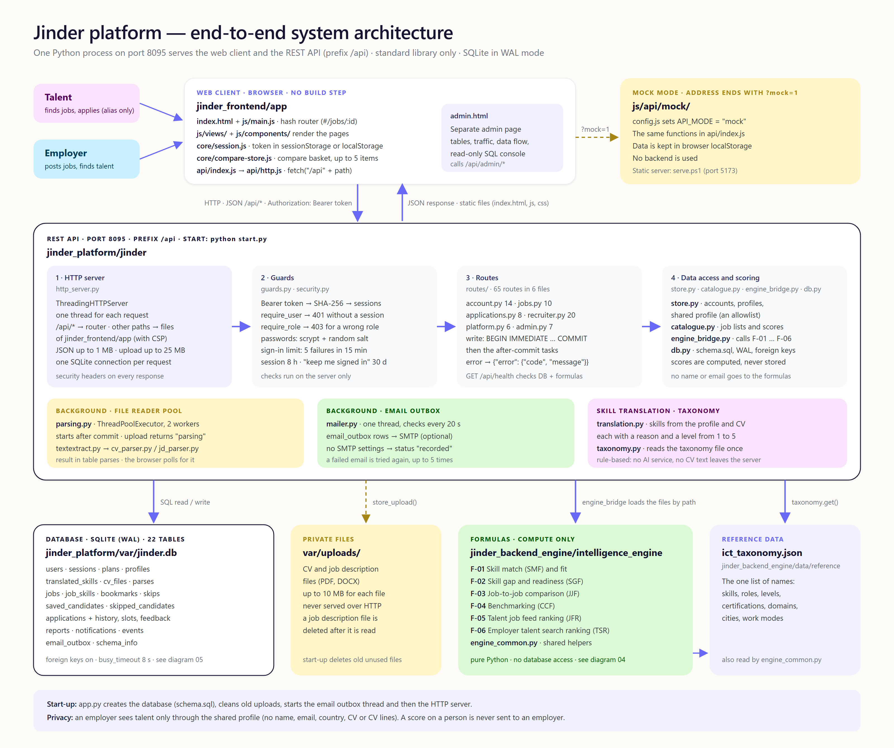

# Jinder System Architecture Guide

This guide gives a short view of the Jinder system.
The full explanation is in [SYSTEM_ARCHITECTURE_DIAGRAMS.md](../architecture/SYSTEM_ARCHITECTURE_DIAGRAMS.md).



Diagram source: [01_system_architecture_overview.html](../architecture/diagrams/01_system_architecture_overview.html).

---

## 1. Repository folders

```
Excelerate-Skill-Bridge/
├── Document/                # documentation
│   ├── guides/              # start guide and this guide
│   ├── architecture/        # architecture documents and diagrams/
│   ├── sdd/                 # software design description (read-only source documents)
│   ├── prompt/              # prompt principles and the API contract prompt
│   └── ai_rule/             # AI governance and boundaries
├── Presentation/            # HTML presentations and a copy of admin.html
├── Skill/                   # 5 agent skill folders
├── Data/                    # data provenance notes, reference, sample_csv, synthetic
├── scripts/                 # helper scripts
├── jinder_frontend/app/     # the web client (HTML, CSS, JavaScript)
├── jinder_platform/         # the REST API, the SQLite database and the tests
├── jinder_backend_engine/   # the six formulas, the taxonomy and the datasets
└── old_version/             # archived files (not used)
```

---

## 2. The main parts

### A. Web client — `jinder_frontend/app`

- A one-page app in plain JavaScript modules. It has no build step.
- `index.html` loads `js/main.js`. The hash router is in `js/core/router.js`.
- The views use only `js/api/index.js` to talk to the backend.
- `js/api/http.js` calls the real API at `/api`.
- Mock mode: add `?mock=1` to the address. The app then uses `js/api/mock/`. The mock keeps its data in the browser `localStorage`.
- `admin.html` is a separate admin page. It calls `/api/admin/*`.

### B. REST API — `jinder_platform/jinder`

- Start command: `python start.py` in the folder `jinder_platform`.
- Default address: `http://localhost:8095/`. The health check is `GET /api/health`.
- The API prefix is `/api`. The same server also serves the files of `jinder_frontend/app`.
- The server uses only the Python standard library. The class is `ThreadingHTTPServer`: one thread for each request.
- The layers are: `http_server.py` (HTTP), `guards.py` and `security.py` (session and role checks), `routes/` (65 routes in 6 files), `store.py`, `catalogue.py`, `engine_bridge.py` and `db.py` (data and scores).
- Passwords use `scrypt`. The database stores only the SHA-256 hash of a session token.
- Failed sign-ins have a rate limit: 5 failures in 15 minutes for one email and one address.
- Two background workers run in the process: the file reader pool (`parsing.py`, 2 workers) and the email outbox (`mailer.py`, every 20 seconds).

### C. Storage — `jinder_platform/var`

- `jinder.db`: SQLite in WAL mode with 22 tables. The schema is in `jinder/schema.sql`.
- `uploads/`: private CV and job description files. The server never serves this folder.
- The scores are not stored. The API computes them for each request.

### D. Formulas — `jinder_backend_engine/intelligence_engine`

- Six formula files (F-01 to F-06) and `engine_common.py`.
- They are pure Python functions. They do not use the database.
- `engine_bridge.py` loads them by path and calls them.
- The taxonomy is `jinder_backend_engine/data/reference/ict_taxonomy.json`. The platform (`taxonomy.py`) and the formulas (`engine_common.py`) read the same file.
- The folder `jinder_backend_engine/backend` is an earlier prototype server. The platform does not use it. It also uses port 8095, so do not start both at the same time.

---

## 3. Settings

`jinder_platform/jinder/config.py` reads these environment variables. A `.env` file in `jinder_platform` can also set them.

| Variable | Default | Use |
|---|---|---|
| `JINDER_HOST` | `127.0.0.1` | The address that the server listens on |
| `JINDER_PORT` (or `PORT`) | `8095` | The port |
| `JINDER_APP_DIR` | `jinder_frontend/app` | The web client folder |
| `JINDER_ENGINE_DIR` | `jinder_backend_engine/intelligence_engine` | The formula folder |
| `JINDER_TAXONOMY_PATH` | `jinder_backend_engine/data/reference/ict_taxonomy.json` | The taxonomy file |
| `JINDER_DB_PATH` | `jinder_platform/var/jinder.db` | The database file |
| `JINDER_UPLOAD_DIR` | `jinder_platform/var/uploads` | The private upload folder |
| `JINDER_CORS_ORIGINS` | empty | Origins that may call the API from another address |
| `JINDER_SMTP_HOST` and other `JINDER_SMTP_*` | empty | Optional SMTP for the email outbox |

---

## 4. More detail

- Frontend: [FRONTEND_ARCHITECTURE_DETAIL.md](../architecture/FRONTEND_ARCHITECTURE_DETAIL.md) (diagram 02)
- Backend: [BACKEND_ARCHITECTURE_DETAIL.md](../architecture/BACKEND_ARCHITECTURE_DETAIL.md) (diagram 03)
- Formulas: [FORMULA_ARCHITECTURE_DETAIL.md](../architecture/FORMULA_ARCHITECTURE_DETAIL.md) (diagram 04)
- Data model: [DATA_MODELING_ARCHITECTURE_DETAIL.md](../architecture/DATA_MODELING_ARCHITECTURE_DETAIL.md) (diagram 05)
- Data flow: [DATA_FLOW_ARCHITECTURE.md](../architecture/DATA_FLOW_ARCHITECTURE.md) (diagram 06)
- Cloud plan: [CLOUD_MIGRATION_PLAN.md](../architecture/CLOUD_MIGRATION_PLAN.md) (diagrams 07 and 08)
